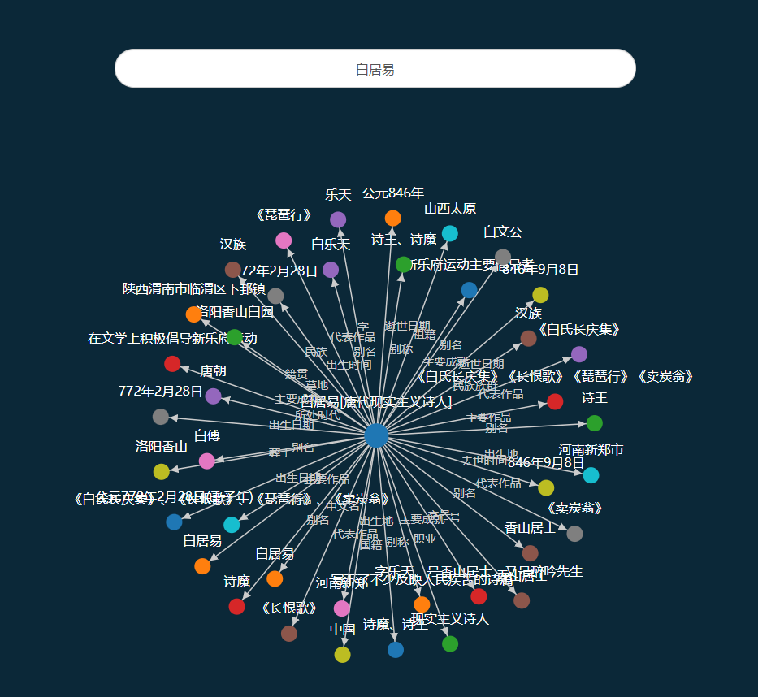
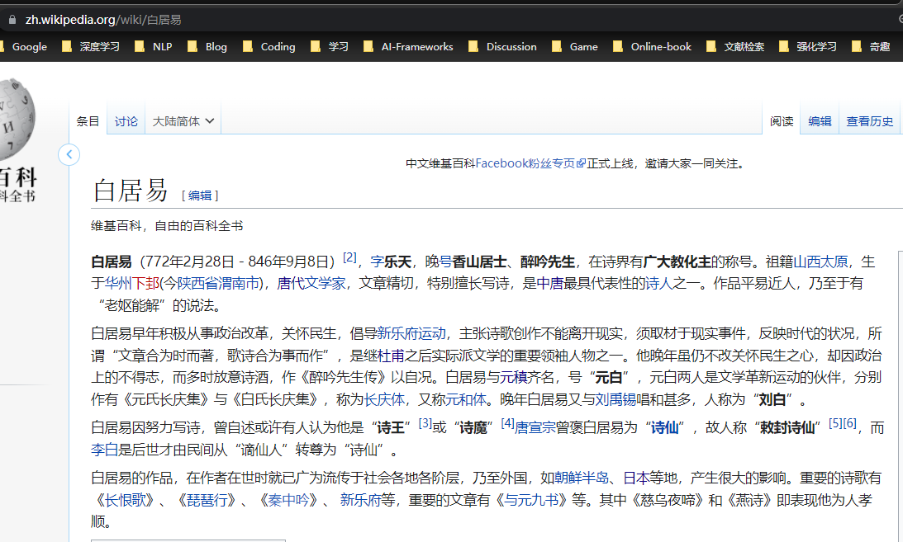

# 古诗词-诗人-相关扩展

参考资料：

- [初中必背34首古诗词赏析](https://zhuanlan.zhihu.com/p/88800108)

## 诗人/词人

### 诗人名：

- 唐朝诗人

  虞世南、王绩、上官仪、卢照邻、骆宾王、李峤、杜审言、张若虚、苏味道、刘希夷、杨炯、崔融、宋之问、沈全期、贺知章、陈子昂、王涯、王之涣、张九龄、张旭、唐玄宗、王翰、孟浩然、李颀、寒山、綦毋潜、常建、刘长卿、祖咏、王湾、李颀、崔颢、祖咏、高適、王维、裴迪、李白、高适、崔曙、刘缭日、储光羲、常建、刘长卿、杜甫、岑参、皇甫冉、元结、司空曙、钱起、顾况、张继、僧皎然、戴叔伦、韦应物、卢纶、李益、李端、孟郊、权德舆、王建、韩愈、张籍、薛涛、李绅、白居易、刘禹锡、柳宗元、马戴、元稹、贾岛、姚合、李贺、杜秋娘、马戴、杜牧、薛逢、李群玉、陈陶、李商隐、温庭筠、李频、郑畋、韦庄、司空图、聂夷中、皮日休、韩偓、杜荀鹤、崔涂、韩雄、许浑、张乔、张祜、秦韬玉、刘方平、夏侯审

  筛选示例：

  - 知识图谱

    

  - 维基百科

    

- 宋朝词人

  张孝祥、刘克庄、石孝友、史达祖、欧阳修、卢祖皋、毛滂、宋自逊、李煜、韩元吉、杨万里、方岳、王安石、柳永、张先、周邦彦、王安国、袁去华、赵佶、黄机、叶梦得、吴潜、王建、晁补之、薛昭蕴、卢炳、李珣、朱淑真、戴复古、宋祁、蔡伸、贺铸、文及翁、林逋、张抡、李清照、孙光宪、俞国宝、程垓、牛希济、冯延巳、徐昌图、王清惠、王观、朱服、时彦、王禹偁、严蕊、张志和、秦观、晏几道、蒋捷、周芝、万俟咏、曹勋、黄庭坚、严仁、陈亮、姜夔、朱敦儒、吴文英、陆游、张炎、向子諲、李好古、刘禹锡、李白、汪藻、戴叔伦、李之仪、顾夐、侯蒙、皇甫松、李璟、张昪、黄升、杨无咎、黄裳、温庭筠、房舜卿、寇准、潘阆、岳飞、叶清臣、范成大、陈东甫、王雱、仲殊、黄公绍、白居易、韩缜、李元膺、牛峤、刘辰翁、刘过、张元干、韦庄、张耒、黄孝迈、李重元、谢逸、曹组、唐婉、辛弃疾、赵长卿、吕本中、张舜民、晏殊、苏轼、王炎、韩疁、陈与义、蒋氏女、范仲淹

### 宋词三百首

- 刘克庄 长相思·惜梅

- 韩疁 浪淘沙·莫上玉楼看

- 孙光宪 浣溪沙·蓼岸风多橘柚香

- 辛弃疾 清平乐·村居

- 赵佶 燕山亭·北行见杏花

- 冯延巳 清平乐·雨晴烟晚

- 韦庄 思帝乡·春日游

- 韩元吉 霜天晓角·题采石蛾眉亭

- 李煜 浪淘沙令·帘外雨潺潺

- 文及翁 贺新郎·西湖

- 辛弃疾 贺新郎·甚矣吾衰矣

- 范仲淹 苏幕遮·怀旧

- 仲殊 诉衷情·宝月山作

- 韩缜 凤箫吟·锁离愁

- 徐昌图 临江仙·饮散离亭西去

- 柳永 安公子·远岸收残雨

- 牛峤 忆江南·衔泥燕

- 李璟 摊破浣溪沙·菡萏香销翠叶残

- 蒋捷 虞美人·听雨

- 白居易 长相思·汴水流

- 韦庄 菩萨蛮·劝君今夜须沉醉

- 辛弃疾 永遇乐·京口北固亭怀古

- 朱淑真 眼儿媚·迟迟春日弄轻柔

- 白居易 浪淘沙·借问江潮与海水

- 辛弃疾 摸鱼儿·更能消几番风雨

- 姜夔 暗香·旧时月色

- 李白 三五七言 / 秋风词

- 张先 天仙子·水调数声持酒听

- 王安石 桂枝香·金陵怀古

- 岳飞 满江红·写怀

- 晁补之 摸鱼儿·东皋寓居

- 石孝友 卜算子·见也如何暮

- 张孝祥 水调歌头·和庞佑父

- 曹勋 饮马歌·边头春未到

- 赵长卿 临江仙·暮春

- 周邦彦 虞美人·疏篱曲径田家小

- 黄庭坚 水调歌头·游览

- 黄孝迈 湘春夜月·近清明

- 苏轼 浣溪沙·簌簌衣巾落枣花

- 苏轼 西江月·顷在黄州

- 秦观 八六子·倚危亭

- 周邦彦 夜游宫·叶下斜阳照水

- 陆游 卜算子·咏梅

- 李珣 巫山一段云·古庙依青嶂

- 陆游 诉衷情·当年万里觅封侯

- 李煜 长相思·一重山

- 周邦彦 少年游·并刀如水

- 周紫芝 鹧鸪天·一点残红欲尽时

- 刘克庄 沁园春·答九华叶贤良

- 时彦 青门饮·寄宠人

- 周邦彦 玉楼春·桃溪不作从容住

- 贺铸 杵声齐·砧面莹

- 黄裳 减字木兰花·竞渡

- 李煜 相见欢·林花谢了春红

- 吴文英 风入松·听风听雨过清明

- 辛弃疾 丑奴儿·书博山道中壁

- 李元膺 洞仙歌·雪云散尽

- 黄庭坚 清平乐·春归何处

- 李清照 醉花阴·薄雾浓云愁永昼

- 柳永 蝶恋花·伫倚危楼风细细

- 苏轼 临江仙·夜饮东坡醒复醉

- 严仁 玉楼春·春思

- 李煜 虞美人·春花秋月何时了

- 李煜 捣练子令·深院静

- 柳永 定风波·自春来

- 蒋捷 一剪梅·舟过吴江

- 辛弃疾 南乡子·登京口北固亭有怀

- 贺铸 石州引·薄雨初寒

- 李清照 如梦令·常记溪亭日暮

- 欧阳修 浪淘沙·把酒祝东风

- 李清照 如梦令·昨夜雨疏风骤

- 姜夔 念奴娇·闹红一舸

- 房舜卿 忆秦娥·与君别

- 李清照 南歌子·天上星河转

- 吴文英 莺啼序·春晚感怀

- 谢逸 江神子·杏花村馆酒旗风

- 刘辰翁 兰陵王·丙子送春

- 晏几道 临江仙·梦后楼台高锁

- 刘辰翁 西江月·新秋写兴

- 王清惠 满江红·题南京夷山驿

- 晏殊 清平乐·红笺小字

- 张孝祥 西江月·阻风山峰下

- 姜夔 鹧鸪天·己酉之秋苕溪记所见

- 苏轼 西江月·世事一场大梦

- 柳永 雨霖铃·寒蝉凄切

- 陈亮 水调歌头·送章德茂大卿使虏

- 白居易 花非花

- 辛弃疾 青玉案·元夕

- 苏轼 江城子·乙卯正月二十日夜记梦

- 黄公绍 青玉案·年年社日停针线

- 刘禹锡 潇湘神·斑竹枝

- 李煜 乌夜啼·昨夜风兼雨

- 佚名 菩萨蛮·枕前发尽千般愿

- 贺铸 半死桐·重过阊门万事非

- 杨无咎 柳梢青·茅舍疏篱

- 苏轼 念奴娇·赤壁怀古

- 韦庄 女冠子·昨夜夜半

- 俞国宝 风入松·一春长费买花钱

- 苏轼 水龙吟·次韵章质夫杨花词

- 辛弃疾 水龙吟·过南剑双溪楼

- 苏轼 水调歌头·明月几时有

- 李清照 点绛唇·蹴罢秋千

- 毛滂 惜分飞·泪湿阑干花著露

- 姜夔 长亭怨慢·渐吹尽

- 王安石 浪淘沙令·伊吕两衰翁

- 苏轼 蝶恋花·春景

- 皇甫松 梦江南·兰烬落

- 白居易 忆江南·江南好

- 苏轼 定风波·莫听穿林打叶声

- 岳飞 小重山·昨夜寒蛩不住鸣

- 张孝祥 六州歌头·长淮望断

- 张先 青门引·春思

- 温庭筠 望江南·梳洗罢

- 潘阆 酒泉子·长忆观潮

- 宋祁 玉楼春·春景

- 贺铸 芳心苦·杨柳回塘

- 朱淑真 蝶恋花·送春

- 苏轼 洞仙歌·冰肌玉骨

- 宋自逊 蓦山溪·自述

- 柳永 迷仙引·才过笄年

- 韦庄 菩萨蛮·人人尽说江南好

- 晏几道 鹧鸪天·彩袖殷勤捧玉钟

- 陈东甫 长相思·花深深

- 范仲淹 渔家傲·秋思

- 辛弃疾 鹧鸪天·有客慨然谈功名因追念少年时事戏作

- 刘过 唐多令·芦叶满汀洲

- 吴潜 江城子·示表侄刘国华

- 张先 千秋岁·数声鶗鴂

- 袁去华 瑞鹤仙·郊原初过雨

- 史达祖 双双燕·咏燕

- 姜夔 齐天乐·蟋蟀

- 张元干 贺新郎·寄李伯纪丞相

- 王安国 清平乐·春晚

- 晏几道 蝶恋花·醉别西楼醒不记

- 秦观 满庭芳·山抹微云

- 秦观 行香子·树绕村庄

- 李煜 相见欢·无言独上西楼

- 李煜 清平乐·别来春半

- 范成大 蝶恋花·春涨一篙添水面

- 李清照 清平乐·年年雪里

- 秦观 千秋岁·水边沙外

- 苏轼 江城子·密州出猎

- 姜夔 踏莎行·自沔东来丁未元日至金陵江上感梦而作

- 欧阳修 渔家傲·近日门前溪水涨

- 李璟 摊破浣溪沙·手卷真珠上玉钩

- 佚名 浣溪沙·五两竿头风欲平

- 李清照 鹧鸪天·寒日萧萧上琐窗

- 陆游 鹊桥仙·华灯纵博

- 秦观 浣溪沙·漠漠轻寒上小楼

- 张耒 秋蕊香·帘幕疏疏风透

- 张孝祥 念奴娇·过洞庭

- 黄机 霜天晓角·仪真江上夜泊

- 陈亮 水龙吟·春恨

- 叶梦得 点绛唇·绍兴乙卯登绝顶小亭

- 晏殊 蝶恋花·槛菊愁烟兰泣露

- 苏轼 永遇乐·彭城夜宿燕子楼

- 刘克庄 贺新郎·送陈真州子华

- 温庭筠 菩萨蛮·小山重叠金明灭

- 吴文英 浣溪沙·门隔花深梦旧游

- 辛弃疾 菩萨蛮·书江西造口壁

- 蒋氏女 减字木兰花·题雄州驿

- 李清照 凤凰台上忆吹箫·香冷金猊

- 吕本中 采桑子·恨君不似江楼月

- 辛弃疾 破阵子·为陈同甫赋壮词以寄之

- 王建 宫中调笑·团扇

- 史达祖 绮罗香·咏春雨

- 戴叔伦 调笑令·边草

- 辛弃疾 太常引·建康中秋夜为吕叔潜赋

- 刘克庄 贺新郎·九日

- 贺铸 青玉案·凌波不过横塘路

- 辛弃疾 西江月·遣兴

- 张先 醉垂鞭·双蝶绣罗裙

- 辛弃疾 清平乐·独宿博山王氏庵

- 李白 忆秦娥·箫声咽

- 李重元 忆王孙·春词

- 张抡 踏莎行·秋入云山

- 牛希济 生查子·新月曲如眉

- 朱敦儒 相见欢·金陵城上西楼

- 黄升 清平乐·宫怨

- 柳永 望海潮·东南形胜

- 朱服 渔家傲·小雨纤纤风细细

- 王雱 眼儿媚·杨柳丝丝弄轻柔

- 欧阳修 踏莎行·候馆梅残

- 黄庭坚 鹧鸪天·座中有眉山隐客史应之和前韵即席答之

- 刘过 西江月·堂上谋臣尊俎

- 姜夔 扬州慢·淮左名都

- 苏轼 浣溪沙·游蕲水清泉寺

- 杨万里 好事近·七月十三日夜登万花川谷望月作

- 晏几道 阮郎归·旧香残粉似当初

- 冯延巳 鹊踏枝·几日行云何处去

- 陆游 夜游宫·记梦寄师伯浑

- 晏几道 鹧鸪天·小令尊前见玉箫

- 陈与义 临江仙·夜登小阁忆洛中旧游

- 李好古 谒金门·花过雨

- 张孝祥 西江月·问讯湖边春色

- 周邦彦 瑞龙吟·大石春景

- 张舜民 卖花声·题岳阳楼

- 周邦彦 西河·大石金陵

- 晏几道 更漏子·柳丝长

- 柳永 八声甘州·对潇潇暮雨洒江天

- 卢祖皋 江城子·画楼帘幕卷新晴

- 晏几道 清平乐·留人不住

- 刘克庄 玉楼春·戏林推

- 贺铸 思越人·紫府东风放夜时

- 白居易 忆江南三首

- 程垓 卜算子·独自上层楼

- 王安石 渔家傲·平岸小桥千嶂抱

- 冯延巳 谒金门·风乍起

- 杨万里 昭君怨·赋松上鸥

- 严蕊 卜算子·不是爱风尘

- 吴潜 满江红·送李御带珙

- 李清照 一剪梅·红藕香残玉簟秋

- 欧阳修 蝶恋花·庭院深深深几许

- 汪藻 点绛唇·新月娟娟

- 李煜 虞美人·风回小院庭芜绿

- 冯延巳 鹊踏枝·谁道闲情抛掷久

- 周邦彦 解语花·上元

- 朱敦儒 鹧鸪天·西都作

- 韦庄 菩萨蛮·红楼别夜堪惆怅

- 向子諲 秦楼月·芳菲歇

- 姜夔 点绛唇·丁未冬过吴松作

- 苏轼 卜算子·黄州定慧院寓居作

- 张昪 离亭燕·一带江山如画

- 曹组 蓦山溪·梅

- 韦庄 女冠子·四月十七

- 欧阳修 生查子·元夕

- 李清照 蝶恋花·暖雨晴风初破冻

- 朱淑真 谒金门·春半

- 佚名 望江南·天上月

- 仲殊 南柯子·十里青山远

- 李清照 武陵春·春晚

- 姜夔 疏影·苔枝缀玉

- 顾夐 诉衷情·永夜抛人何处去

- 秦观 江城子·西城杨柳弄春柔

- 吴文英 唐多令·惜别

- 李之仪 卜算子·我住长江头

- 王炎 南柯子·山冥云阴重

- 周邦彦 蝶恋花·早行

- 陆游 钗头凤·红酥手

- 皇甫松 采莲子·菡萏香莲十顷陂

- 欧阳修 诉衷情·眉意

- 戴复古 柳梢青·岳阳楼

- 贺铸 六州歌头·少年侠气

- 晏殊 浣溪沙·一向年光有限身

- 张炎 八声甘州·记玉关踏雪事清游

- 张炎 清平乐·候蛩凄断

- 秦观 望海潮·洛阳怀古

- 晏殊 山亭柳·赠歌者

- 晁补之 盐角儿·亳社观梅

- 佚名 鹊踏枝·叵耐灵鹊多谩语

- 秦观 踏莎行·郴州旅舍

- 周邦彦 六丑·落花

- 朱敦儒 好事近·摇首出红尘

- 秦观 鹊桥仙·纤云弄巧

- 叶清臣 贺圣朝·留别

- 方岳 水调歌头·平山堂用东坡韵

- 叶梦得 水调歌头·秋色渐将晚

- 王禹偁 点绛唇·感兴

- 柳永 鹤冲天·黄金榜上

- 欧阳修 渔家傲·花底忽闻敲两桨

- 晏殊 浣溪沙·一曲新词酒一杯

- 周邦彦 满庭芳·夏日溧水无想山作

- 王观 卜算子·送鲍浩然之浙东

- 侯蒙 临江仙·未遇行藏谁肯信

- 张志和 渔歌子·西塞山前白鹭飞

- 周邦彦 兰陵王·柳

- 苏轼 定风波·南海归赠王定国侍人寓娘

- 辛弃疾 西江月·夜行黄沙道中

- 寇准 踏莎行·春暮

- 林逋 相思令·吴山青

- 薛昭蕴 浣溪沙·红蓼渡头秋正雨

- 唐婉 钗头凤·世情薄

- 冯延巳 长命女·春日宴

- 李白 菩萨蛮·平林漠漠烟如织

- 刘禹锡 竹枝词·山桃红花满上头

- 李清照 渔家傲·天接云涛连晓雾

- 张元干 贺新郎·送胡邦衡待制赴新州

- 蔡伸 苍梧谣·天

- 李清照 声声慢·寻寻觅觅

- 卢炳 减字木兰花·莎衫筠笠

- 万俟咏 三台·清明应制

- 吴文英 八声甘州·灵岩陪庾幕诸公游

- 周邦彦 苏幕遮·燎沉香

- 李煜 破阵子·四十年来家国

- 晏殊 破阵子·春景

- 黄庭坚 念奴娇·断虹霁雨

- 卢祖皋 宴清都·初春

- 李珣 南乡子·乘彩舫

- 刘克庄 卜算子·片片蝶衣轻

- 陆游 秋波媚·七月十六日晚登高兴亭望长安南山

- 辛弃疾 贺新郎·别茂嘉十二弟

## **初中语文古诗词常见意象归纳**

酒、饮酒

多表达豪情、悲愁、苦闷和郁郁不得志的情感。

1.抽刀断水水更流，举杯消愁愁更愁。（《宣州谢脁楼饯别校书叔云》李白）

2.东篱把酒黄昏后，有暗香盈袖。（《醉花阴》李清照）

3.金樽清酒斗十千，玉盘珍馐直万钱。（《行路难》李白）

4.浊酒一杯家万里，燕然未勒归无计。（《渔家傲》范仲淹）

5.酒酣胸胆尚开张，鬓微霜，又何妨！（《江城子*密州出猎》苏轼）

6.一曲新词酒一杯，去年天气旧亭台。（《浣溪沙》晏殊）

羌笛

多传达离别之苦、相思之情和内心的孤寂。唐代边塞诗中经常提到：

1、中军置酒饮归客，胡琴琵琶与羌笛。（《白雪歌送武判官归京》岑参）

2.羌管悠悠霜满地，人不寐，将军白发征夫泪。（《渔家傲》范仲淹）

3.羌笛何须怨杨柳，春风不度玉门关。（《凉州词》王之涣）

柳

折柳 “柳”与“留”谐音，因此“柳”带有伤离别的意味。而“折柳”就有相留之意。

1.此夜曲中闻折柳，何人不起故园情。（《春夜洛城闻笛》李白）

2.渭城朝雨浥轻尘，客舍青青柳色新。（《送元二使安西》王维）

月（残月、明月、新月、玉盘）

在许多诗人笔下都是思乡、念亲的标志，多传达离愁别恨、寂寞思归之情。

1.我寄愁心与明月，随君直到夜郎西。（《闻王昌龄左迁龙标遥有此寄》李白）

2.明月几时有，把酒问青天。（《水调歌头·明月几时有》苏轼）

3.月落乌啼霜满天，江枫渔火对愁眠。（《枫桥夜泊》张继）

4.月下飞天镜，云生结海楼。（《渡荆门送别》李白）

5.晓镜但愁云鬓改，夜吟应觉月光寒。（《无题》李商隐）

流水

多传达人生苦短、命运无常的感伤与哀愁。

1.抽刀断水水更流，举杯消愁愁更愁。（《宣州谢脁楼饯别校书叔云》李白）

2.水何澹澹，山岛竦峙。（《短歌行》曹操）

斜阳（夕阳、落日）

多传达凄凉失落、苍茫沉郁、怀古幽情。

1.大漠孤烟直，长河落日圆。（《使至塞上》王维）

2.四面边声连角起，千嶂里，长烟落日孤城闭。（《渔家傲》范仲淹）

3.过尽千帆皆不是，斜晖脉脉水悠悠。肠断白蘋洲。（《望江南》温庭筠）

4.夕阳西下，断肠人在天涯。（《天净沙·秋思》马致远）

浮云

比喻在外漂泊的游子。

浮云游子意，落日故人情。（《送友人》李白）

风、霜、烟

多传达哀怨、惆怅、凄苦、苍凉等情思。

1.日暮乡关何处是？烟波江上使人愁。（《黄鹤楼》崔颢）

2.半卷红旗临易水，霜重鼓寒声不起。（《雁门太守行》李贺）

3.风住尘香花已尽，日晚倦梳头。（《武陵春》李清照）

4.城阙辅三秦，风烟望五津。（《送杜少府之任蜀州》王勃）

落花（落红、残红）

多传达青春易逝、人生无常的深沉喟叹和哀愁。

1.风住尘香花已尽，日晚倦梳头。（《武陵春》李清照）

2.无可奈何花落去，似曾相识燕归来，小园香径独徘徊。（《浣溪沙》晏殊）

3.落红不是无情物，化作春泥更护花。（《己亥杂诗》龚自珍）

松

坚贞高洁

岂不罹凝寒，松柏有本性。（《赠从弟》刘桢）

梅

傲霜斗雪，不怕打击挫折，纯净洁白。

零落成泥碾作尘，只有香如故。（《卜算子·咏梅》陆游）

菊

坚贞高洁

采菊东篱下，悠然见南山。（《饮酒（其五）》陶渊明）

萍

多传达惆怅和哀愁

山河破碎风飘絮，身世浮沉雨打萍。（《过零丁洋》文天祥）

梧桐

凄凉悲伤的象征

无言独上西楼，月如钩。寂寞梧桐深院锁清秋。《相见欢》李煜）

草木

多以草木繁盛反衬荒凉，以抒发盛衰兴亡的感慨。

1.国破山河在，城春草木深。（《春望》杜甫）

2.树木丛生，百草丰茂。（《短歌行》曹操）

杜鹃（子规）

凄凉哀伤的象征

杨花落尽子规啼，闻道龙标过五溪。（《闻王昌龄左迁龙标遥有此寄》李白）

鸿雁、青鸟

多传达相思相爱、离愁、孤寂的情思。

1.蓬山此去无多路，青鸟殷勤为探看。（《无题》李商隐）

2.乡书何处达？归雁洛阳边。（《次北固山下》王湾）

舟

表达离情别绪、思乡、愁苦之情。

1.只恐双溪舴艋舟，载不动许多愁。（《武陵春》李清照）

2.仍怜故乡水，万里送行舟。（《渡荆门送别》李白）

3.客路青山外，行舟绿水前。（《次北固山下》王湾）

## **初中语文古诗词典故归纳**

**1.怀旧空吟闻笛赋，到乡翻似烂柯人。——刘禹锡《酬乐天扬州初逢席上见赠》**

典故：闻笛赋——指西晋向秀所作的《思旧赋》。向秀跟嵇康是好朋友，嵇康因不满司马氏集团而被杀，向秀经过嵇康故居时，听见有人吹笛，不禁悲从中来，于是作《思旧赋》。

烂柯人——指晋人王质。王质上山砍柴，看见两个童子下棋，就停下观看。等棋局终了，手中的斧把已经朽烂。回到村里，才知道已过了一百年了。

在诗中的意思和作用：诗人是借这两个典故说自己在外二十三年，如今回来，许多老朋友都已去世，只能徒然地吟诵“闻笛赋”表示悼念而已。此番回来恍如隔世，觉得人事全非，不再是旧日的光景了。后一句用王质烂柯的典故，既暗示了自己贬谪时间的长久，又表现了世态的变迁，以及回归之后生疏而怅惘的心情，涵义十分丰富。

**2.浊酒一杯家万里，燕然未勒归无计。——范仲淹《渔家傲·秋思》**

典故：勒石燕然——用的是《后汉书·窦融列传》中的典故，东汉时窦宪率兵打败匈奴，一直追击到燕然山，刻石纪功而还。

在词中的意思和作用：词人在这里正面揭示了自己和征人们的一种心理矛盾：他们思念相距万里的家乡，但却没有办法回去，因为还没有达到建立军功、勒石燕然的目的。词人借用典故把自己的思乡与忧国、报国之情交织在一起。

**3.为报倾城随太守，亲射虎，看孙郎。——苏轼《江城子·密州出猎》**

典故：亲射虎，看孙郎——孙郎即孙权，《三国志》记载孙权在一次出行中，坐骑为虎所伤，他镇定地在马前击毙了老虎。

在词中的意思和作用：词人的意思是他要像当年的孙权那样挽弓马前射虎，这突出地展现了作者虽年纪已经不小，但是仍有着少年狂气。

**4.持节云中，何日遣冯唐？——苏轼《江城子·密州出猎》**

典故：遣冯唐——据《史记·张释之冯唐列传》记载：汉文帝时，魏尚为云中太守，抵御匈奴有功，只因报功时多报了六个首级而获罪削职。后来，文帝采纳了冯唐的劝谏，派冯唐持符节到云中去赦免魏尚。

在词中的意思和作用：这里作者是以魏尚自喻，表达作者希望朝廷能像派冯唐赦魏尚那样重用自己。

**5.会挽雕弓如满月，西北望，射天狼。——苏轼《江城子·密州出猎》**

典故：射天狼——天狼星，据《晋书·天文志》说是“主侵掠”的。

在词中的意思和作用：这里用以代指从西北来进扰的西夏军队。词人在这句中表达了自己要报效国家，抵御入侵者，建功立业的决心。

**6.八百里分麾下炙……马作的卢飞快。——辛弃疾《破阵子·为陈同甫赋壮词以寄之》**

典故：八百里——指牛。据《世说新语·汰侈》载：晋王恺有良牛，名“八百里駮”后世诗词多以“八百里”指牛。

的卢——良马名。据《三国志·蜀志·先主传》载，刘备在荆州遇险，他所骑的的卢马“一踊三丈”驮他脱险。

在词中的意思和作用：形象的描写了军旅的生活和表现了抗金将士的英雄气概。

## **初中语文课内外古诗词主题分类**

**1.送别诗，表达依依不舍之情，或劝勉友人乐观开朗的感情。**

《白雪歌送武判官归京》 岑参 唐

《送杜少府之任蜀州》王勃 唐

**2.离别之诗，抒发对家乡的思念。**

《渡荆门送别》李白 唐

《次北固山下》 王湾 唐

**3.别后对家人，对朋友的思念。**

《夜雨寄北》李商隐 唐

《闻王昌龄左迁龙标遥有此寄》 李白 唐

《水调歌头》苏轼 宋

《武陵春》李清照 宋

《望江南》 温庭筠 宋

《蒹葭》 《诗经》 春秋

《无题》 李商隐 唐

**4.表达思归之心，羁旅之愁。**

《天净沙*秋思》 马致远 元

**5.表达对古人的缅怀之情，抒发历史兴亡之感。**

《赤壁》杜牧 唐

《山坡羊·潼关怀古》张养浩 元

**6.表达对战争的厌恶，对和平生活的向往。**

《石壕吏》 杜甫 唐

《春望》杜甫 唐

**7.对统治者的批判，对劳动人民的同情。**

《观刈麦》白居易 唐

《泊秦淮》杜牧 唐

**8.对田园生活的向往，表达闲适恬淡的心情。**

《归园田居（其三）》 陶渊明 东晋

《饮酒（其五）》陶渊明 东晋

《游山西村》 陆游 宋

《西江月》辛弃疾 宋

**9.表达忧国之思、报国之志、忧民之心。**

《过零丁洋》文天祥 宋

《已亥杂诗》龚自珍 清

《茅屋为秋风所破歌》 杜甫 唐

《渔家傲》 范仲淹 宋

《江城子·密州出猎》 苏轼 宋

《雁门太守行》 李贺 唐

《破阵子·为陈同甫赋壮词以寄之》辛弃疾 宋

**10.即景抒情/ 言志**

《登飞来峰》王安石 宋

《望岳》 杜甫 唐

《使至塞上》王维 唐

《观沧海》曹操 三国

**11.抒发对自身遭遇的感慨**

《酬乐天扬州初逢席上见赠》刘禹锡 唐

《行路难》李白 唐

《相见欢》李煜 唐

**12.抒发对春天等美好景物的喜爱之情。**

《早春呈水部张十八员外》韩愈唐

《钱塘湖春行》白居易 唐

**13.表现对年华已逝，好景不长的感伤。**

《浣溪沙》 晏殊 宋

**14.对国事的关心，代父从军的叙事诗**

《木兰诗》《乐府民歌》 南北朝

**15.表达对爱情、理想的追求。**

《关雎》 《诗经》

《春秋》

## **初中语文部分诗词名句寓意简析**

1.海日生残夜，江春入旧年。——王湾《次北固山下》

新事物孕育于旧事物解体之时。

2.会当凌绝顶，一览众山小。——杜甫《望岳》

说明站得高望得远的道理。说明要有藐视和压倒一切困难的雄心和气概，才能有所作为的人生哲理。

3.山重水复疑无路，柳暗花明又一村。——陆游《游山西村》

常用来形容进入一个别有天地的境界，或比喻绝处逢生的情景。

4.沉舟侧畔千帆过，病树前头万木春。——刘禹锡《酬乐天扬州初逢席上见赠》

说明新事物必将取代旧事物。表达了任何腐朽势力都不可逆转历史潮流，新生力量必将茁壮成长的思想。

5.雄兔脚扑朔，雌兔眼迷离；双兔傍地走，安能辨我是雄雌？——《木兰诗》

比喻事情错综复杂，不易辨清真相。

6.东风不与周郎便，铜雀春深锁二乔。——杜牧《赤壁》

抒发历史兴亡之感，蕴含机遇造人的哲理。

7.人有悲欢离合，月有阴晴圆缺，此事古难全。——苏轼《水调歌头》

世上没有十全十美的事物。

8.不畏浮云遮望眼，只缘身在最高层。——王安石《登飞来峰》

站得高看得远。