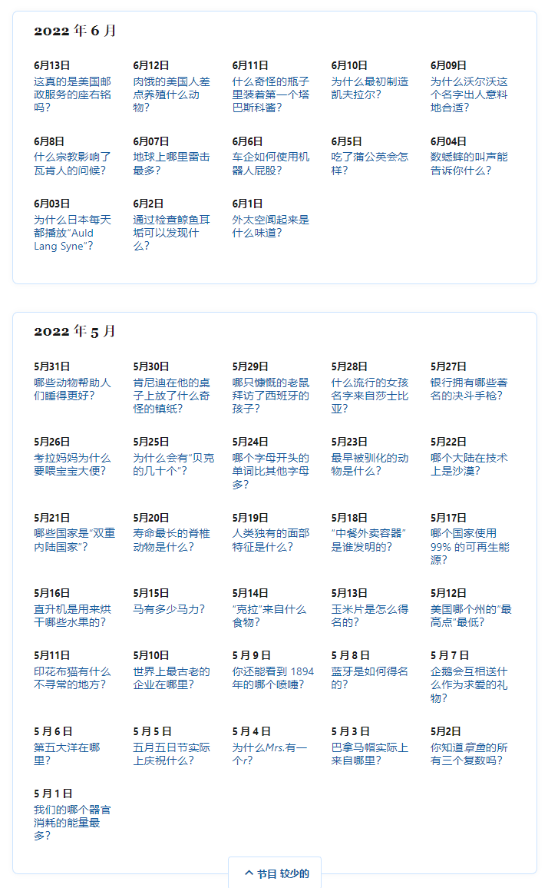

# 地理主题扩展

大范围：

- 初中地理知识
- 常见名词

## 1、地理主题相关

参考资料：

- **中国的世界文化遗产**

### 1、著名历史山岳

黄山、庐山、雁荡山、泰山、华山、衡山、恒山、嵩山、峨眉山、五台山、普陀山、九华山、龙虎山、武当山、青城山、齐云山、武夷山、神农架

### 2、湖泊

洞庭湖、西湖、太湖、鄱阳湖、洪泽湖、

### 3、古代景点、中国的世界遗产名单

嘉峪关、玉门关、八达岭长城、承德避暑山庄、桂林山水、草堂、武侯祠、故宫、莫高窟、秦始皇陵、孔林、布达拉宫、丽江古城、苏州园林、颐和园、大足石刻、龙门石窟、都江堰、云冈石窟、安阳殷墟、开平碉楼、乐山大佛、良渚古城、九寨沟、武当山古建筑群、峨眉山-乐山大佛、天坛、丽江古城、平遥古城、开平碉楼、福建土楼、

### 4、中国的非物质遗产

昆区、古琴、蒙古族长调民歌、

### 5、二十四节气

立春、雨水、惊蛰、春分、清明、谷雨、立夏、小满、芒种、夏至、小暑、大暑、立秋、处暑、白露、秋分、寒露、霜降、立冬、小雪、大雪、冬至、小寒、大寒。

## 2、网络数据源--初中课本知识

### **初中地理总复习资料(世界地理)**

参考数据源：

- [【初中地理】会考复习知识点总结](https://zhuanlan.zhihu.com/p/111602625)
- [地理常识500条](http://www.gaosan.com/gaokao/418638.html)

### **初中地理会考重要知识点总结**

Clipped from: https://m.liuxue86.com/a/4206581.html　

## 3、中国国家地理杂志

官网：http://www.dili360.com/

- ### 地文景观

  - [平原](http://www.dili360.com/travel/sight/20201.htm)、[戈壁](http://www.dili360.com/travel/sight/20213.htm)、[峡谷](http://www.dili360.com/travel/sight/20214.htm)、[峰林](http://www.dili360.com/travel/sight/20215.htm)、[钙华](http://www.dili360.com/travel/sight/20216.htm)、[石柱](http://www.dili360.com/travel/sight/20399.htm)、[火山](http://www.dili360.com/travel/sight/20400.htm)、[岩石](http://www.dili360.com/travel/sight/20401.htm)、[雪山](http://www.dili360.com/travel/sight/20648.htm)、[绿洲](http://www.dili360.com/travel/sight/20212.htm)、[沙地](http://www.dili360.com/travel/sight/20211.htm)、[雅丹](http://www.dili360.com/travel/sight/20210.htm)、[山地](http://www.dili360.com/travel/sight/20202.htm)、[丘陵](http://www.dili360.com/travel/sight/20203.htm)、[高原](http://www.dili360.com/travel/sight/20204.htm)、[盆地](http://www.dili360.com/travel/sight/20205.htm)、[喀斯特](http://www.dili360.com/travel/sight/20206.htm)、[洞穴](http://www.dili360.com/travel/sight/20207.htm)、[石林](http://www.dili360.com/travel/sight/20208.htm)、[丹霞](http://www.dili360.com/travel/sight/20209.htm)、[彩丘](http://www.dili360.com/travel/sight/24545.htm)

- ### 水文景观

  - [湿地](http://www.dili360.com/travel/sight/20190.htm)、[礁石](http://www.dili360.com/travel/sight/20199.htm)、[冰川](http://www.dili360.com/travel/sight/20198.htm)、[湖泊](http://www.dili360.com/travel/sight/20197.htm)、[冲积扇](http://www.dili360.com/travel/sight/20196.htm)、[三角洲](http://www.dili360.com/travel/sight/20195.htm)、[岛屿](http://www.dili360.com/travel/sight/20194.htm)、[半岛](http://www.dili360.com/travel/sight/20193.htm)、[海岸](http://www.dili360.com/travel/sight/20192.htm)、[河流](http://www.dili360.com/travel/sight/20191.htm)、[瀑布](http://www.dili360.com/travel/sight/20397.htm)

- ### 生物景观

  - [热带雨林](http://www.dili360.com/travel/sight/20218.htm)、[草原](http://www.dili360.com/travel/sight/20219.htm)、[牧场](http://www.dili360.com/travel/sight/20220.htm)、[林场](http://www.dili360.com/travel/sight/20221.htm)、[林地](http://www.dili360.com/travel/sight/20222.htm)、[农场](http://www.dili360.com/travel/sight/20223.htm)、[庄园](http://www.dili360.com/travel/sight/20224.htm)、[花地](http://www.dili360.com/travel/sight/20225.htm)、[梯田](http://www.dili360.com/travel/sight/20226.htm)

- ### 气象与天象景观

  - [观星地](http://www.dili360.com/travel/sight/20228.htm)、[海市蜃楼](http://www.dili360.com/travel/sight/20229.htm)、[云雾](http://www.dili360.com/travel/sight/20230.htm)、[极光](http://www.dili360.com/travel/sight/20231.htm)、[雾凇](http://www.dili360.com/travel/sight/20644.htm)、[星空天象](http://www.dili360.com/travel/sight/20649.htm)

- ### 遗址与遗迹景观

  - [寺庙](http://www.dili360.com/travel/sight/20233.htm)、[古塔](http://www.dili360.com/travel/sight/20245.htm)、[古村](http://www.dili360.com/travel/sight/20246.htm)、[古镇](http://www.dili360.com/travel/sight/20247.htm)、[陵墓](http://www.dili360.com/travel/sight/20248.htm)、[宫殿](http://www.dili360.com/travel/sight/20249.htm)、[化石景观](http://www.dili360.com/travel/sight/20251.htm)、[古典园林](http://www.dili360.com/travel/sight/20252.htm)、[古道](http://www.dili360.com/travel/sight/20396.htm)、[古楼](http://www.dili360.com/travel/sight/20244.htm)、[祠堂](http://www.dili360.com/travel/sight/20243.htm)、[岩壁画](http://www.dili360.com/travel/sight/20234.htm)、[遗址](http://www.dili360.com/travel/sight/20235.htm)、[碑石牌坊](http://www.dili360.com/travel/sight/20236.htm)、[石窟](http://www.dili360.com/travel/sight/20237.htm)、[石刻](http://www.dili360.com/travel/sight/20238.htm)、[民居](http://www.dili360.com/travel/sight/20239.htm)、[名人故居故里](http://www.dili360.com/travel/sight/20240.htm)、[民俗村](http://www.dili360.com/travel/sight/20241.htm)、[纪念园（馆/碑）](http://www.dili360.com/travel/sight/20242.htm)、[古城](http://www.dili360.com/travel/sight/20639.htm)

- ### 建筑与城市景观

  - [工业基地](http://www.dili360.com/travel/sight/20254.htm)、[公园](http://www.dili360.com/travel/sight/21638.htm)、[城市建筑](http://www.dili360.com/travel/sight/20636.htm)、[现代园林](http://www.dili360.com/travel/sight/20266.htm)、[铁路](http://www.dili360.com/travel/sight/20265.htm)、[高速](http://www.dili360.com/travel/sight/20264.htm)、[国道](http://www.dili360.com/travel/sight/20263.htm)、[矿山公园](http://www.dili360.com/travel/sight/20262.htm)、[桥梁](http://www.dili360.com/travel/sight/20261.htm)、[运河](http://www.dili360.com/travel/sight/20260.htm)、[水电站](http://www.dili360.com/travel/sight/20259.htm)、[大坝](http://www.dili360.com/travel/sight/20258.htm)、[水库](http://www.dili360.com/travel/sight/20257.htm)、[电视塔](http://www.dili360.com/travel/sight/20256.htm)、[农业基地](http://www.dili360.com/travel/sight/20255.htm)、[公路](http://www.dili360.com/travel/sight/23578.htm)
  
- ### 人文活动景观

  - [城区](http://www.dili360.com/travel/sight/20268.htm)、[边城](http://www.dili360.com/travel/sight/20269.htm)、[口岸](http://www.dili360.com/travel/sight/20270.htm)、[博物馆](http://www.dili360.com/travel/sight/20271.htm)、[科技馆](http://www.dili360.com/travel/sight/20272.htm)、[展览馆](http://www.dili360.com/travel/sight/20273.htm)、[影视城](http://www.dili360.com/travel/sight/20274.htm)、[游乐园](http://www.dili360.com/travel/sight/20275.htm)、[温泉](http://www.dili360.com/travel/sight/20276.htm)

## 4、中国气象

气象科普官网：http://www.qxkp.net/

气象知识官网：http://www.qxzs.org.cn/

## 5、大英百科--在线版

官网：https://www.britannica.com/

#### 类别：

- 健康与医学
  - 解剖学和生理学、条件和疾病、遗传学与进化、健康-营养-健身、人类发展、药物、心理与心理健康
- 文学
- 运动与休闲
- 地理与旅游
  - 城市与城镇、世界各国、历史名城、人文地理学、语言、土地自然地理
- 生活方式与社会问题
- 科学
- 技术世界史

#### [栏目--好的事实](https://www.britannica.com/one-good-fact/all-good-facts)

## 基于Wiki词汇表进行单词信息抽取

时间：2022-06-14

- 'drive/MyDrive/Database/word_dict/html/wiki-dizhixue.html'

['深海平原', '绝对约会', '吸积', '酸岩', '余震', '凝聚', '总计的', '钠长石', '碱性', '碱性岩', '异类', '冲积扇', '冲积', '琥珀色', '闪石', '角闪岩', '杏仁核', '深熔', '红柱石', '安山岩', '角度不整合', '钙长石', '背斜', '隐晶质', '花岗岩', '含水层', '文石海', '太古宙', '群岛', '砂质的', '竞技场', '砂砾', '阿尔科斯', '泥质', '灰', '沥青', '组装宝石', '软流圈', '奥吉特', '光环', '本土', '带状铁形成', '玄武岩', '地下室岩石', '基础摇滚', '盆地', '盆地和山脉省', '地基', '基岩', '现在之前', '生物侵蚀', '生物地层学', '生物地层学', '黑云母', '生物扰动', '蓝片岩', '布丹', '巨石', '鲍文反应系列', '咸咸的', '面包屑炸弹', '角砾岩', '屈曲', '钙质', '方解石', '方解石海', '钙质', '火山口', '寒武纪', '碳膜', '碳酸盐', '碳酸盐硬地', '铸件', '新生代', '粉笔', '燧石', '亚氯酸盐', '碎屑', '碎屑岩', '粘土', '乳沟', '鹅卵石', '颗石', '颗石藻', '压实', '压缩', '贝壳状', '结石', '企业集团', '接触变质作用', '大陆地壳', '大陆边缘', '陆架', '收敛边界', '柯巴脂', '粪石', '堇青石', '核', '核心石', '围岩', '克拉通', '交叉铺垫', '原油', '脆皮', '隐晶质', '水晶', '水晶习性', '结晶度', '英安', '子产品', '三角洲', '降解', '枝晶', '沉积', '脱离故障', '成岩作用', '混杂岩', '底辟', '硅藻土', '透辉石', '闪长岩', '堤', '倾角', '不一致', '分界线', '白云石', '美元', '钻芯', '鼓乐', '纯岩', '硬壳', '地震', '榴辉石', '埃米亚越界', '永', '震中', '闪长岩', '表观遗传', '时代', '侵蚀', '不稳定的', '悬崖', '谢谢', '河口', '优地汇', '自面体', '平稳运动', '蒸发岩', '去角质', '扩大', '挤压的', '相', '扇形', '过错', '断层带', '长石', '恶魔', '长方形', '铁混凝土', '铁镁矿物', '裂变轨道约会', '法兰德里亚犯规', '折叠', '叶化', '化石', '化石', '石化', '断裂', '镓', '辉长岩', '石榴石', '胃石', '宝石学', '宝石', '地质图', '地质时间尺度', '地质学', '地槽', '玻璃', '海绿石', '片麻岩', '冈瓦纳', '地堑', '花岗岩', '花岗岩', '粒细胞', '花岗闪长岩', '碎石', '灰瓦克', '绿玉', '碎石', '习惯', '半衰期', '硬盘', '合页', '铰链线', '角闪石', '角岩', '地垒', '温泉', '热液', '热液喷口', '高盐', '技术学', '火成岩', '点燃', '钛铁矿', '顽固的', '夹层', '入侵', '岛弧', '同构', '同位素', '联合的', '侏罗纪', 'K a', '龟', '高岭石', '喀斯特', '水壶', '纠结', '扭结带', '蓝晶石', '空白', '灯火石', '岩浆', '白质的', '石灰石', '液化', '石片', '石化', '岩性', '石型', '黄土', '光泽', '嘛', '镁铁质', '岩浆', '磁铁矿', '马姆斯伯里集团', '地幔', '大理石', '海洋露台', '泥灰', '混色', '忧郁症', '中庸的', '中生代', '变质岩', '变质', '变泥土', '元性', '云母', '微古生物学', '大洋中脊', '混合岩', '矿物', '矿化', '矿物学', '微地槽', '莫氏矿物硬度标度', '糖蜜', '成型', '单斜', '单斜', '碛', '直棂', '白云母', '纳米比亚时代', '新近纪', '非碎屑', '正常故障', '黑曜石', '寡聚酶', '黄绿', '奥陶纪', '造山运动', '造山运动', '正长石', '正地槽', '斜方', '原硅酸盐', '牛轭湖', '帕霍霍', '古生代', '古洋流', '古生物学', '帕拉哥石', '石器时代的', '伟晶岩', '珍珠岩', '橄榄岩', '岩石学', '酚醛树脂', '斑晶', '千枚岩', '千层石', '穿刺点', '沥青石', '板块构造', '更新世', '上新世', '深成的', '羽状结构', '气溶', '多组学', '多合成孪晶', '卟啉细胞', '斑岩', '前寒武纪', '沉淀', '推进变质作用', '原石', '砂岩', '伪矩阵', '浮石', '火山碎屑流', '火山碎屑', '辉石', '辉石岩', '石英岩', '第四纪', '区域变质作用', '网纹石', '逆行变质作用', '反向故障', '流纹岩', '裂痕', '羊岩', '岩石', '粗犷的', '矿石', '糖类', '沙', '砂岩', '山尼丁', '片岩', '碎石', '沉淀池', '沉积岩', '序列', '绢云母', '页岩', '剪切带', '盾', '瓦海滩', '矽胶', '淤泥', '石板', '板条劈裂', '滑面', '暴跌', '土壤液化', '排序', '洞穴探险', '斯芬', '十字星石', '结石', '风暴岭', '拉紧', '地层学', '针线石', '表面的', '正长岩', '向斜', '句法', '桌山集团', '距骨', '地壳板块', '泰克泰特', '韧性', '拉面', '特提斯海洋', '直到', '相信', '地形', '托', '痕迹化石', '粗面岩', '石灰华', '三临床', '凝灰岩', '苔原', '浊积岩', '浊流', '泰格伯格队形', '超镁铁', '空泡', '华力西造山运动', '瓦尔韦', '静脉', '蛭石', '辐辏', '泡状', '陈列柜', '体外植物', '火山', '火山炸弹', '孔', '摆动轨迹', '黑钨矿', '包体', '异时', 'X射线衍射', 'X 射线荧光', '木质煤', '黄色蛋糕', '杨氏模量', '伊普雷西亚语', '沸石', '锆石']