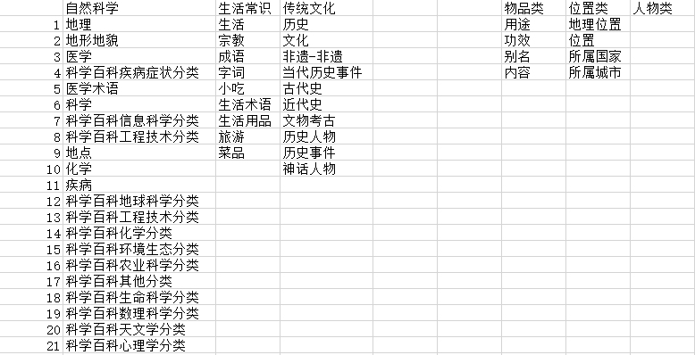

# Ownthink_v2的数据分析及后续信息提取研究


**策划(困困)的数据梳理思路：**

- 使用知识图谱的属性值对数据进行筛选，根据不同的属性对数据信息进行提取

  1. 自然科学

     1. 地理
   2. 医学
     3. 疾病
   4. 科学百科
  
  2. 生活常识
  
     1. 生活
     2. 成语
     3. 字词
     4. 旅游
  
  3. 传统文化
  
     1. 历史
     2. 文化
     3. 历史事件
     4. 文物考古
  
     




### 数据抽取实践

- 测试案例：ownthink-split-$0$
- 数据量：50,000
- 信息抽取方法：使用`属性`值进行筛选
- 目前的信息抽取情况：
  - `属性值`--描述：3650条


## <span style='color:brown'>目前的知识图谱数据处理流水线</span>

**主要步骤：**

1. 根据策划对不同领域的标签，定向抽取想要的信息，并分别保存在不同的小标签文件中：
   - 策划提供领域的分类信息列表
2. 对提取的信息进行再次筛选，删除无效的信息：
   - 策划提供无效的标签的列表


**目前针对问题生成，需要统计的两个核心指标数据：**

1. 抽取的信息的有效性(最后是否可用、是否是需要的)
2. 生成的问题的质量(合格率百分比)


### 1、定向抽取信息：

```python
# 提取出需要提取的标签信息
label_list = []
import csv
with open('./drive/MyDrive/Database/human_chosen_label/cul.csv', 'r', encoding='utf-8-sig') as csvfile:
    csvReader = csv.DictReader(csvfile)
    for row in csvReader:
        label_list.append(row['label'])
print(label_list)

# 导入需要处理的原始数据
dataframe = pd.read_csv('./split-ownthink-0.csv')

# 进行信息抽取
for chosen_label in label_list:
    print('chosen_label: ', chosen_label)  
    for i in range(len(dataframe)):
        if dataframe.loc[i, '值'] == chosen_label:
            j = 1
            k = 0
            for j in range(i):
                if dataframe.loc[i, '实体'] == dataframe.loc[i-j, '实体']:
                    j = j + 1
                    if dataframe.loc[i-j+1, '属性'] == '标签':
                        k = k + 1
                    else:
                        continue
                else:
                    break
            each_data = dataframe.loc[i-j+1:i-k]
            print('each_data: ', each_data)
            print('\n')
            each_data.to_csv('extract_cul.csv', mode='a', header=False, encoding='utf-8-sig')  
```

### 2、删除无效的词条信息

```python
import csv
from collections import OrderedDict

useless_label_list = ['描述', '中文名', '外文名', '外文名称', '英文名', '英文名称']

with open('./drive/MyDrive/Database/human_chosen_label/results/extract_cul-demo.csv', 'r', encoding='utf-8') as csvfile:
    csvReader = csv.DictReader(csvfile)
    for row in csvReader:
        if row['属性'] in useless_label_list:
            pass
        else:
            with open('test.csv', 'a', encoding='utf-8-sig') as file:
                new_list = ','.join([i for i in row.values()])
                file.write(new_list)
                file.write('\n')
```


## 数据处理的信息流优化、

**目前的数据信息处理逻辑梳理：**

```python
label_list = []
import csv
import pandas as pd

# 人工选择的可用标签，并依据此标签进行词条分类
with open('./drive/MyDrive/Database/human_chosen_label/label/all_label.csv', 'r', encoding='utf-8-sig') as csvfile:
    csvReader = csv.DictReader(csvfile)
    for row in csvReader:
        label_list.append(row['label'])
print(label_list)

# 导入无效的属性值信息
useless_label_list = ['描述', '中文名', '中文名称', '外文名', '门票价格', '外文名称', '英文名', '英文名称','音标', '拼音', '注音', '简称', '拉丁名', '拉丁学名', '拉丁缩写']

# 导入需要分类的词条数据信息
dataframe = pd.read_csv('./drive/MyDrive/Database/split/split-ownthink-10.csv', usecols=['实体', '属性', '值'], index_col=False)

# 对原表中的index进行重新排序
dataframe.reset_index(drop=True, inplace=True)
```

```python
# 遍历词条数据，并进行分类任务
for i in range(len(dataframe)):
    i_label = dataframe.loc[i, '值']
    if i_label in label_list:
        # print('i_label: ', i_label)
        filename = i_label + '.csv'
        save_path = './drive/MyDrive/Database/test_data/test_results/' + filename
        j = 1
        k = 0
        for j in range(i):
            if dataframe.loc[i, '实体'] == dataframe.loc[i-j, '实体']:
                j = j + 1
                if dataframe.loc[i-j+1, '属性'] == '标签':
                    k = k + 1
                else:
                    continue
            else:
                break
        # SettingwithCopyWarning -- Chained assignment
        each_data = dataframe.loc[i-j+1:i-k].copy()
        # print('each_data: ', each_data)
        # print('\n')
        # 删除无效的属性词条信息
        for useless_label in useless_label_list:
            each_data.drop(each_data.loc[each_data['属性']==useless_label].index, inplace=True) 
        # print('each_data_delete_useless_label: ', each_data)
        # print('\n')
        if each_data.empty:
            pass
        else:
            each_data.to_csv(save_path, mode='a', header=False, index=False, encoding='utf-8-sig') 
```

```python
import pandas as pd
import glob
import os

path = r'./drive/MyDrive/Database/test_data/test_results' # use your path

all_files = glob.glob(path + "/*.csv")

for filename in all_files:
    df = pd.read_csv(filename, on_bad_lines='skip')
    df.columns = ['实体', '属性', '值']
    fname = filename.split('/')[-1:][0]
    fname = os.path.splitext(fname)[0]
    df.to_csv('./drive/MyDrive/Database/test_data/add_columns/'+fname+ '.csv', encoding='utf-8-sig')
```


# 目前针对知识图谱数据的信息提取探索

目前的研究思路：

- 通过对知识图谱信息的概览，需要进一步使用更加高效的方法提取目前题库生成所需的信息词条。


目前可行的技术方案有：

1. 扩大策划人工抽取及查看的数据信息量，找到所需的信息具有的特征，然后进行批量处理；
2. 对目前的知识图谱三元组的`实体`值进行聚类方面的研究，看能否通过不同词性的分类，把无效的信息进行删除；


