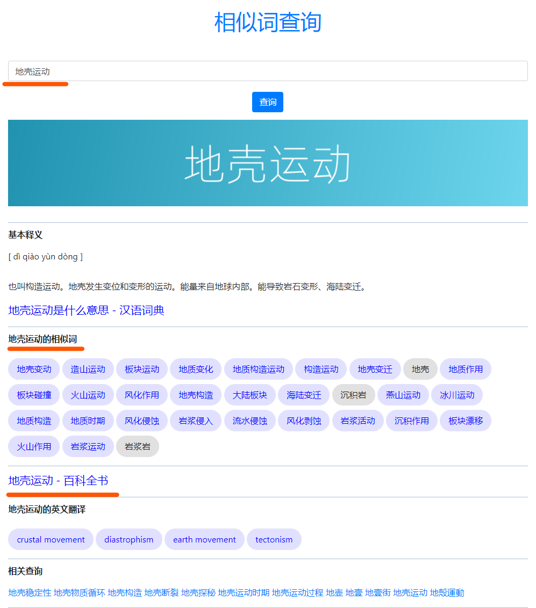
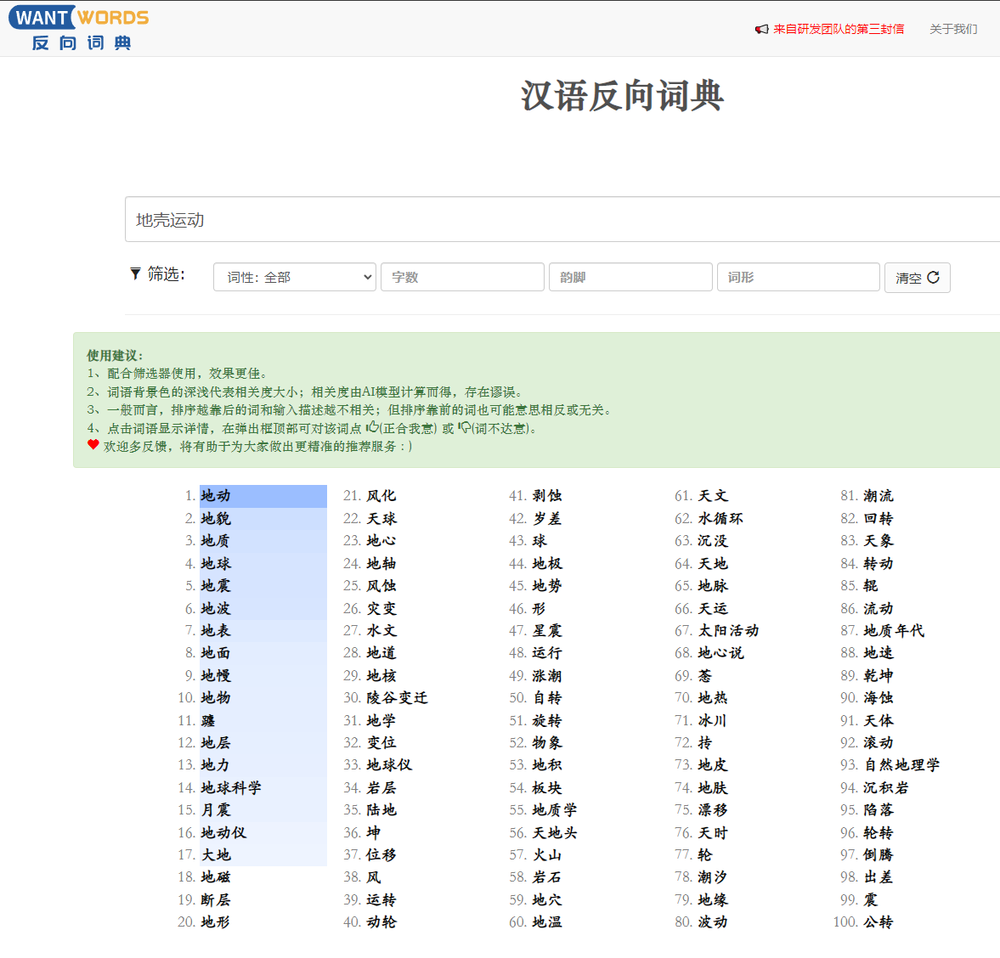

# 题库生成错误答案的需求调研

### 原题库的事例：

|                             题目                             |                     正确答案                      |                     错误答案                      |                     错误答案                      |
| :----------------------------------------------------------: | :-----------------------------------------------: | :-----------------------------------------------: | :-----------------------------------------------: |
| “会当凌绝顶，一览众山小”出自杜甫的《望岳》，这句诗所描写的是哪里的风景？ |     **泰山**      |     **东山**      |     **黄山**      |
| “出师未捷身先死，长使英雄泪满襟”是杜甫的著名诗句，这首诗所怀念的是哪位古人？ |                      诸葛亮                       |                       项羽                        |                       韩信                        |
| “日出江花红胜火，春来江水绿如蓝”是白居易的著名诗句，这首诗所描写的是哪里的风景？ | **景色如画的江南** | **美丽富饶的巴蜀** | **热闹繁华的长安** |
| “横看成岭侧成峰，远近高低各不同”出自苏轼的《题西林壁》，它所描写的是哪里的景观？ |                     江西庐山                      |                     山东泰山                      |                     安徽黄山                      |
| “五岳”是历史悠久的五大名山之总称，其中享有“奇险天下第一山”美誉的是那一座山？ |                     西岳华山                      |                     东岳泰山                      |                     中岳嵩山                      |

#### **目前基于知识图谱、人工抽取、维基百科语料生成的问题展示**

- **知识图谱**

  |             文本-Text              |    生成的问题-Question    | 生成的答案-Answer |
  | :--------------------------------: | :-----------------------: | :---------------: |
  |  沉积岩, 形成, 地壳发展、岩石风化  | 什么地质特征导致了沉积岩? |       风化        |
  |      黄土高原, 别称, 乌金高原      |   黄土高原的别名是什么?   |     乌金高原      |
  | 龙抬头, 节日时间, 每年农历二月二日 |     龙抬头是什么时候?     |   农历二月二日    |
  |     白云苍狗, 反义词, 一成不变     |  白云苍狗的反义词是什么   |     一成不变      |

  

- **人工抽取**

  |                          文本-Text                           |               生成的问题-Question                | 生成的答案-Answer |
  | :----------------------------------------------------------: | :----------------------------------------------: | :---------------: |
  |       大理石的主要成分是碳酸钙，纯净的碳酸钙是白色的。       |             大理石的主要成分是什么？             |      碳酸钙       |
  |    地震就是大地的震动，绝大多数地震是由于地壳运动引起的。    |              地震的自然现象是什么？              |     地壳运动      |
  | 紫外线是阳光电磁波谱的不可见部分，它会杀伤白血球，危害人和动物的机体。 | 什么类型的辐射会杀伤白血球、危害人和动物的机体？ |      紫外线       |
  | 战国老子的《道德经》以“阴阳”来论述、发挥其思想主张，西汉儒生董仲舒的《春秋繁露》将其思想进一步发展。 |             《春秋繁露》的作者是谁？             |      董仲舒       |

  

- **维基百科**

  |                          文本-Text                           |   生成的问题-Question    | 生成的答案-Answer |
  | :----------------------------------------------------------: | :----------------------: | :---------------: |
  | 寿喜烧，又称锄烧，是一种日本料理，以少量酱汁烹饪食材的火锅。 |   寿喜烧又被称为什么？   |       锄烧        |
  | 茴香是一种耐寒的多年生草本植物，可以长到2.5米，呈粉绿色笔直状。 | 茴香的叶子是什么颜色的？ |      粉绿色       |
  |      红河哈尼梯田是在云南省红河哈尼族彝族自治州的梯田。      | 哈尼梯田分布在什么地方？ |       云南        |
  |          阿司匹林也称乙酰水杨酸，通常用作止痛、消炎          |  阿司匹林又被称为什么？  |    乙酰水杨酸     |

  

**需求描述：**

- 根据问题生成的正确答案，生成相近或具有迷惑性的错误答案。

**分析：**

- 词性很相近，短名词较容易找到近义词，需要制定各种不同词性的表，然后进行随机性生成；

**策划--困困给出的建议**

1. 句式结构相同的短语；
2. 近义词或反义词、需要限定在相同领域内；

**什么是相似词？**

相似，指类似的意思，按日常习惯用法，相似词一般指同义词，也可能包含反义词（因为属于同一类型的词语）。

1. 近义词指意思相近，但不完全相同的词，比如：“开心”和“高兴”、“谦虚”和“谦逊”、“满意”和“欣慰”；
2. 反义词是指两个意思相反的词，比如：“真”和“假”，“美”和“丑”；
3. 等义词指意思完全相同的词；
4. 同义词包括近义词和等义词；

## 目前的调研思路

- 研究一个词语的相关词、近义词或同义词，然后进行扩展，

#### **参考网站：**

- [宇宙最全在线词典网站导航](https://github.com/Dictionaryphile/All_Dictionaries#%E5%90%8C%E4%B9%89%E8%AF%8D)
- 同义词
  - [WantWords  Github](https://github.com/thunlp/WantWords)
  - [WantWords](https://wantwords.net/)
- 近义词
  - [词林](https://www.cilin.org/jyc/)
  - [KMcha](https://kmcha.com/similar)

### **1、KM相似词查询事例**

官网地址：

- [KMcha](kmcha.com/similar/)

**思路分析：**

通过定向请求的方式，直接在KMcha网站搜索正确答案的相近词，然后由文案策划自行决定需要选取的错误答案选项。

需要的技术为：在内网对外网的固定域名进行访问，然后爬取、解析需要的数据信息，供后续进行挑选。

### **2、Google -- word2vec**

- [tool - 网址](https://code.google.com/archive/p/word2vec/)

该工具提供了连续词袋和skip-gram架构的有效实现，用于计算词的向量表示。这些表示随后可用于许多自然语言处理应用程序和进一步研究。

**工作原理**

*word2vec*工具将文本语料库作为输入，并生成词向量作为输出。它首先从训练文本数据中构建一个词汇表，然后学习单词的向量表示。生成的词向量文件可用作许多自然语言处理和机器学习应用程序中的特征。研究学习表示的一种简单方法是为用户指定的词找到最接近的词。距离工具服务于这个目的。

**数据来源**

词向量的质量随着训练数据量的增加而显着提高。出于研究目的，您可以考虑使用在线可用的数据集：

- [来自维基百科的前十亿个字符（使用来自](http://mattmahoney.net/dc/enwik9.zip)[Matt Mahoney 页面](http://mattmahoney.net/dc/textdata.html)底部的预处理 perl 脚本）；
- [最新的 Wikipedia 转储](http://dumps.wikimedia.org/enwiki/latest/enwiki-latest-pages-articles.xml.bz2)使用与上述相同的脚本来获取干净的文本。应该超过30亿字；
- [WMT11 站点](http://www.statmt.org/wmt11/translation-task.html#download)：多种语言的文本数据（在训练模型之前应删除重复的句子）；
- [来自“十亿字语言建模基准”的数据集](http://www.statmt.org/lm-benchmark/1-billion-word-language-modeling-benchmark-r13output.tar.gz)几乎 1B 字，已经预处理的文本；

**思路分析：**

查看中文领域是否有直接可用且效果能够满足需求的word2vec工具库，最好可以直接快速验证效果。

### **3、WantWords--汉语反向词典**

官方地址：

- [汉语反向词典](https://wantwords.net/)

原理解释：

- 反向词典将目标词的描述作为输入，并将目标词与其他匹配描述的词一起输出。

## 不同方案的效果对比研究

**目标：**

- 评估KMcha、WantWords两种方法的优劣性；

**评估方法：**

1. 先对需要查询的词类进行分类(分类可根据人工抽取标签进行)，然后进行查询对比；
2. 根据之前文案策划提供的题库的答案进行查询对比；

### 1、人工抽取的标签生成的答案的查询对比研究

| 大类 |     子类      | 正确答案 |                            KMcha                             |                             WWs                              |
| :-----------------------------------: | :-----------: | :------: | :----------------------------------------------------------: | :----------------------------------------------------------: |
|               自然科学                |   百科环境    | 热带气旋 | [温带气旋](https://kmcha.com/similar/温带气旋) [热带低气压](https://kmcha.com/similar/热带低气压) [热带低压](https://kmcha.com/similar/热带低压) [西北太平洋](https://kmcha.com/similar/西北太平洋) [热带风暴](https://kmcha.com/similar/热带风暴) [台风登陆](https://kmcha.com/similar/台风登陆) 风暴潮 [台风强度](https://kmcha.com/similar/台风强度) [台风中心](https://kmcha.com/similar/台风中心) 苗柏 [西南季风](https://kmcha.com/similar/西南季风) | **台风** **飓风** **副热带** **飓** **热风** **亚热带** **暖风** **风暴** **温带** **季风气候** **热带雨林** **狂风** **季风** **暴风** **风暴潮** |
|               自然科学                |   百科环境    |  红树林  | [红树林湿地](https://kmcha.com/similar/红树林湿地) [红树林保护区](https://kmcha.com/similar/红树林保护区) [红树林自然保护区](https://kmcha.com/similar/红树林自然保护区) [红树林海岸](https://kmcha.com/similar/红树林海岸) [海上森林](https://kmcha.com/similar/海上森林) 红树林公园 红树林湿地公园 [木麻黄](https://kmcha.com/similar/木麻黄) [珊瑚礁](https://kmcha.com/similar/珊瑚礁) 滩涂湿地 滨海湿地 滩涂 东寨港红树林 湿地 | **灌木林** **丛林** **林木** **密林** **林子** **灌木丛** **乔林** **林薮** **林逋** **灌丛** **林丛** **矮林** **针叶林** |
|               自然科学                |   地理术语    |  沉积岩  | [变质岩](https://kmcha.com/similar/变质岩) [岩浆岩](https://kmcha.com/similar/岩浆岩) [火成岩](https://kmcha.com/similar/火成岩) [石灰岩](https://kmcha.com/similar/石灰岩) [海相沉积](https://kmcha.com/similar/海相沉积) 岩石类型 沉积岩层 [凝灰岩](https://kmcha.com/similar/凝灰岩) [片麻岩](https://kmcha.com/similar/片麻岩) 风化作用 [侵入岩](https://kmcha.com/similar/侵入岩) [硅质岩](https://kmcha.com/similar/硅质岩) [流纹岩](https://kmcha.com/similar/流纹岩) 地质作用 [碳酸岩](https://kmcha.com/similar/碳酸岩) 碳酸盐岩 泥岩 灰岩 地壳运动 地质年代 [沉积层](https://kmcha.com/similar/沉积层) 石英砂岩 砂岩 沉积地层 [玄武岩](https://kmcha.com/similar/玄武岩) [碎屑岩](https://kmcha.com/similar/碎屑岩) 地质构造 岩层 火山碎屑岩 [安山岩](https://kmcha.com/similar/安山岩) | **岩石** **岩层** **地层** **地壳** **火成岩** **岩浆** **石** **岩溶** **石灰岩** **矿层** **矿床** **基底** **地质** **地幔** **围岩** **溶洞** |
|               自然科学                |   自然现象    |  日环食  | [日全食](https://kmcha.com/similar/日全食) [月偏食](https://kmcha.com/similar/月偏食) [日偏食](https://kmcha.com/similar/日偏食) [月全食](https://kmcha.com/similar/月全食) [月食](https://kmcha.com/similar/月食) 半影月食 金星凌日 天文奇观 日食 英仙座流星雨 初亏 天文现象 | **日全食** **日偏食** **全食** **日食** **偏食** **月全食** **眚** **亏蚀** **食相** **日月交食** **月偏食** **月食** **蚀** **既** **日月合璧** |
|               自然科学                |   医学术语    |  红细胞  | [血红细胞](https://kmcha.com/similar/血红细胞) [血细胞](https://kmcha.com/similar/血细胞) [红血球](https://kmcha.com/similar/红血球) [白细胞](https://kmcha.com/similar/白细胞) [血红蛋白](https://kmcha.com/similar/血红蛋白) 血液中红细胞 淋巴细胞 [血小板](https://kmcha.com/similar/血小板) 血红蛋白含量 [血红素](https://kmcha.com/similar/血红素) 血液细胞 红细胞膜 [白血球](https://kmcha.com/similar/白血球) 血浆蛋白 白细胞和血小板 红血细胞 人体血液 造血细胞 血液成分 网织红细胞 红细胞生成 [粒细胞](https://kmcha.com/similar/粒细胞) 红细胞数量 中性粒细胞 单核细胞 白血细胞 骨髓细胞 [细胞数](https://kmcha.com/similar/细胞数) 血小板数量 [血蛋白](https://kmcha.com/similar/血蛋白) | **血细胞** **红血球** **白细胞** **血球** **白血球** **血小板** **干细胞** **血红蛋白** **血蛋白** **血浆** **血色素** **血清** **血液** **血** **凝血酶** **淋巴细胞** **血液病** **溶血** **毛细血管** **淋巴** |
|               自然科学                | 维基百科/科学 |   夏至   | [立秋](https://kmcha.com/similar/立秋) [夏至日](https://kmcha.com/similar/夏至日) [秋分](https://kmcha.com/similar/秋分) [春分](https://kmcha.com/similar/春分) [小暑](https://kmcha.com/similar/小暑) [大暑](https://kmcha.com/similar/大暑) [处暑](https://kmcha.com/similar/处暑) [立夏](https://kmcha.com/similar/立夏) [冬至](https://kmcha.com/similar/冬至) 冬至日 夏至节气 夏至节 [立冬](https://kmcha.com/similar/立冬) [节气](https://kmcha.com/similar/节气) 芒种节气 [霜降](https://kmcha.com/similar/霜降) [芒种](https://kmcha.com/similar/芒种) [初伏](https://kmcha.com/similar/初伏) 春分日 秋分日 日影最短 | **立夏** **三夏** **季夏** **冬至** **孟夏** **立秋** **仲夏** **初夏** **至日** **芒种** **立冬** **初伏** **春天** **小暑** **夏历** |
|               生活常识                |   传统节日    |   七夕   | [七夕节](https://kmcha.com/similar/七夕节) [光棍节](https://kmcha.com/similar/光棍节) [情人节](https://kmcha.com/similar/情人节) [七夕情人节](https://kmcha.com/similar/七夕情人节) [过情人节](https://kmcha.com/similar/过情人节) 明天情人节 单身节 七夕会 七夕怎么过 又是情人节 白色情人节 | **星期** **鹊桥** **中元节** **团圆节** **人日** **中秋** **元宵** **中秋节** **元宵节** **小年夜** **七一** **灯节** **年夜** **重阳** **大年夜** **腊八** |
|               生活常识                |     生活      |  片儿川  | [虾爆鳝面](https://kmcha.com/similar/虾爆鳝面) [虾爆鳝](https://kmcha.com/similar/虾爆鳝) [葱油拌面](https://kmcha.com/similar/葱油拌面) [焖肉面](https://kmcha.com/similar/焖肉面) [牛肉粉丝](https://kmcha.com/similar/牛肉粉丝) [奎元馆](https://kmcha.com/similar/奎元馆) [干挑面](https://kmcha.com/similar/干挑面) 西湖醋鱼 雪菜肉丝面 [辣肉面](https://kmcha.com/similar/辣肉面) [三鲜面](https://kmcha.com/similar/三鲜面) [黄鱼面](https://kmcha.com/similar/黄鱼面) [浇头面](https://kmcha.com/similar/浇头面) [千张包](https://kmcha.com/similar/千张包) [阳春面](https://kmcha.com/similar/阳春面) [大排面](https://kmcha.com/similar/大排面) [小馄饨](https://kmcha.com/similar/小馄饨) 牛肉粉丝汤 [鳝丝面](https://kmcha.com/similar/鳝丝面) [爆鳝面](https://kmcha.com/similar/爆鳝面) 龙井虾仁 [爆鱼面](https://kmcha.com/similar/爆鱼面) 鸭血粉丝汤 | **川地** **平川** **长川** **鲝** **常川** **渎** **临川** **盘川** **湔** **渭川千亩** **畎** **溪流** **蓠** **岷** **汊子** **泸** |
|               生活常识                |     生活      |  岳阳楼  | [滕王阁](https://kmcha.com/similar/滕王阁) [名楼](https://kmcha.com/similar/名楼) [君山岛](https://kmcha.com/similar/君山岛) [江南三大名楼](https://kmcha.com/similar/江南三大名楼) [黄鹤楼](https://kmcha.com/similar/黄鹤楼) 岳阳楼记 [腾王阁](https://kmcha.com/similar/腾王阁) 石鼓书院 三大名楼 中国四大名楼 四大名楼 [天心阁](https://kmcha.com/similar/天心阁) 诗墙 岳麓书院 登黄鹤楼 [谢朓楼](https://kmcha.com/similar/谢朓楼) 南昌滕王阁 | **黄鹤楼** **楚馆秦楼** **门楼** **谢馆秦楼** **湘** **望楼** **西岳** **霍** **衡** **嵝** **凤阁龙楼** **龙门** **岣** **谯** **日观峰** **谯楼** |
|               生活常识                |     小吃      |   豆汁   | [豆汁儿](https://kmcha.com/similar/豆汁儿) [炒肝](https://kmcha.com/similar/炒肝) [喝豆汁](https://kmcha.com/similar/喝豆汁) [麻豆腐](https://kmcha.com/similar/麻豆腐) [面茶](https://kmcha.com/similar/面茶) 炒肝儿 卤煮火烧 焦圈儿 [焦圈](https://kmcha.com/similar/焦圈) [爆肚](https://kmcha.com/similar/爆肚) 北京豆汁 豆腐脑 豆腐脑儿 炸灌肠 豌豆黄 豆汁焦圈 北京小吃 糖油饼 奶油炸糕 老北京豆汁儿 糖火烧 爆肚儿 [甜沫](https://kmcha.com/similar/甜沫) 杂碎汤 锅巴菜 老北京酸奶 [豆沫](https://kmcha.com/similar/豆沫) [炸糕](https://kmcha.com/similar/炸糕) [豆浆](https://kmcha.com/similar/豆浆) 老北京小吃 | **豆浆** **豆乳** **豆酱** **豆沙** **豆渣** **豆粉** **豆花儿** **豆油** **灏** **豆腐** **豆芽** **豆奶** **豆腐脑儿** **豆包** **豆瓣儿酱** **豆蓉** |
|               生活常识                |     字词      |   伏羲   | [轩辕黄帝](https://kmcha.com/similar/轩辕黄帝) [河图洛书](https://kmcha.com/similar/河图洛书) [黄帝](https://kmcha.com/similar/黄帝) [三皇](https://kmcha.com/similar/三皇) [女娲伏羲](https://kmcha.com/similar/女娲伏羲) [盘古](https://kmcha.com/similar/盘古) [炎帝](https://kmcha.com/similar/炎帝) [帝俊](https://kmcha.com/similar/帝俊) 黄帝轩辕 伏羲女娲 伏羲氏 女娲娘娘 伏羲大神 伏羲大帝 [后土](https://kmcha.com/similar/后土) 轩辕氏 燧人氏 [神农](https://kmcha.com/similar/神农) [共工](https://kmcha.com/similar/共工) [天帝](https://kmcha.com/similar/天帝) 后土娘娘 西王母 [少昊](https://kmcha.com/similar/少昊) 轩辕皇帝 盘古大神 [洛书](https://kmcha.com/similar/洛书) [蚩尤](https://kmcha.com/similar/蚩尤) 伏羲帝 火神祝融 [大禹](https://kmcha.com/similar/大禹) | **神农** **羲皇上人** **三皇五帝** **三皇** **先天** **盘古** **牺** **五帝** **炎** **炎黄** **三坟五典** **后羿** **嫘祖** **倥** **炎黄子孙** **禹** **牛郎织女** **轩辕** |
|               生活常识                | 维基百科/生活 |  吕不韦  | [嬴异人](https://kmcha.com/similar/嬴异人) [李斯](https://kmcha.com/similar/李斯) [子楚](https://kmcha.com/similar/子楚) [赵姬](https://kmcha.com/similar/赵姬) [范雎](https://kmcha.com/similar/范雎) 苏秦 秦王 [惠文王](https://kmcha.com/similar/惠文王) 张仪 范睢 赵高 [孟尝君](https://kmcha.com/similar/孟尝君) [春申君](https://kmcha.com/similar/春申君) [秦昭王](https://kmcha.com/similar/秦昭王) [信陵君](https://kmcha.com/similar/信陵君) 秦王嬴政 嬴驷 卫鞅 郭开 入秦 [昭襄王](https://kmcha.com/similar/昭襄王) 赵惠文王 秦昭襄王 蔡泽 [秦孝公](https://kmcha.com/similar/秦孝公) 商鞅 [平原君](https://kmcha.com/similar/平原君) [樗里疾](https://kmcha.com/similar/樗里疾) [秦王政](https://kmcha.com/similar/秦王政) [赵太后](https://kmcha.com/similar/赵太后) | **燕** **张** **申** **孟** **项羽** **秦** **魏** **许** **鲁** **凡** **薛** **纪** **沛公** **韩** **刘邦** |
|               传统文化                |     诗词      |   陈寿   | [三国志](https://kmcha.com/similar/三国志) [裴松之](https://kmcha.com/similar/裴松之) [罗贯中](https://kmcha.com/similar/罗贯中) [魏延](https://kmcha.com/similar/魏延) [孙盛](https://kmcha.com/similar/孙盛) 汉晋春秋 [刘备](https://kmcha.com/similar/刘备) 先主传 [魏略](https://kmcha.com/similar/魏略) 关羽传 [蜀记](https://kmcha.com/similar/蜀记) [邓艾](https://kmcha.com/similar/邓艾) 三国志·诸葛亮传 刘备和诸葛亮 [荀攸](https://kmcha.com/similar/荀攸) 诸葛亮 [曹真](https://kmcha.com/similar/曹真) 三国志·关羽传 裴松之注 [杜预](https://kmcha.com/similar/杜预) [蜀书](https://kmcha.com/similar/蜀书) [陈到](https://kmcha.com/similar/陈到) [曹操](https://kmcha.com/similar/曹操) 诸葛亮传 [裴注](https://kmcha.com/similar/裴注) [姜维](https://kmcha.com/similar/姜维) [徐庶](https://kmcha.com/similar/徐庶) 三国志·先主传 夏侯渊 [晋书](https://kmcha.com/similar/晋书) | **上寿** **阳寿** **寿星** **阴寿** **冥寿** **大寿** **高寿** **老寿星** **寿诞** **过寿** **南山之寿** **寿辰** **千秋** **大庆** **享年** |
|               传统文化                |     诗词      |  司马迁  | [太史公](https://kmcha.com/similar/太史公) [史记](https://kmcha.com/similar/史记) [班固](https://kmcha.com/similar/班固) [报任安书](https://kmcha.com/similar/报任安书) [汉书](https://kmcha.com/similar/汉书) 太史公自序 贾谊 [韩非子](https://kmcha.com/similar/韩非子) 史迁 [司马谈](https://kmcha.com/similar/司马谈) 太史公曰 报任少卿书 项羽本纪 [董仲舒](https://kmcha.com/similar/董仲舒) [后汉书](https://kmcha.com/similar/后汉书) [过秦论](https://kmcha.com/similar/过秦论) [左丘明](https://kmcha.com/similar/左丘明) 商鞅 [战国策](https://kmcha.com/similar/战国策) 史书 [史马迁](https://kmcha.com/similar/史马迁) 李斯 扬雄 究天人之际 孔子 通古今之变 史官 太史公书 张仪列传 孟子 | **左丘明** **左思** **韩非** **屈原** **刘向** **太史** **孟轲** **祖冲之** **周任** **庄子** **先汉** **史乘** **淮南子** **老子** **汉书** **管仲** **刘歆** **西汉** |
|               传统文化                |   历史事件    | 焚书坑儒 | [秦始皇焚书坑儒](https://kmcha.com/similar/秦始皇焚书坑儒) [坑儒](https://kmcha.com/similar/坑儒) [焚书](https://kmcha.com/similar/焚书) [独尊儒术](https://kmcha.com/similar/独尊儒术) [秦始皇](https://kmcha.com/similar/秦始皇) 秦朝 罢黜百家独尊儒术 秦王朝 [罢黜百家](https://kmcha.com/similar/罢黜百家) 始皇帝 [统一六国](https://kmcha.com/similar/统一六国) 始皇 罢黜百家，独尊儒术 秦二世 [秦灭六国](https://kmcha.com/similar/秦灭六国) 秦始皇统一六国 暴秦 大兴文字狱 文字狱 [秦朝灭亡](https://kmcha.com/similar/秦朝灭亡) 书同文 秦二世胡亥 秦帝国 车同轨，书同文 [法家思想](https://kmcha.com/similar/法家思想) 亡秦 法家 统一度量衡 书同文，车同轨 [商鞅变法](https://kmcha.com/similar/商鞅变法) | **废学** **书蠹** **腐儒** **攻书** **背书** **九儒十丐** **以文乱法** **罢教** **儒生** **抄书** **书香** **儒家** **小道** |
|               传统文化                |   维基百科    |  董仲舒  | [独尊儒术](https://kmcha.com/similar/独尊儒术) [罢黜百家，独尊儒术](https://kmcha.com/similar/罢黜百家，独尊儒术) [天人三策](https://kmcha.com/similar/天人三策) [罢黜百家](https://kmcha.com/similar/罢黜百家) 儒家学说 荀子 儒术 罢黜百家独尊儒术 春秋繁露 汉儒 儒家 儒家学者 黄老之学 法家 儒学 孟子 [公孙弘](https://kmcha.com/similar/公孙弘) 晁错 宋儒 贾谊 儒家学派 仲舒 法家思想 汉代儒学 儒学大师 荀况 [司马迁](https://kmcha.com/similar/司马迁) 王充 [韩非子](https://kmcha.com/similar/韩非子) | **管仲** **司马迁** **公孙** **周瑜** **左丘明** **司马** **仲家** **子路** **先圣先师** **孔子** **鲁肃** **公子王孙** **左思** **公孟** |
|               传统文化                |   人工抽取    | 建安风骨 | [建安文学](https://kmcha.com/similar/建安文学) [魏晋风骨](https://kmcha.com/similar/魏晋风骨) [魏晋风流](https://kmcha.com/similar/魏晋风流) [慷慨悲凉](https://kmcha.com/similar/慷慨悲凉) [汉魏风骨](https://kmcha.com/similar/汉魏风骨) [魏晋风度](https://kmcha.com/similar/魏晋风度) [建安七子](https://kmcha.com/similar/建安七子) [建安时期](https://kmcha.com/similar/建安时期) [建安诗人](https://kmcha.com/similar/建安诗人) 汉赋 [盛唐诗歌](https://kmcha.com/similar/盛唐诗歌) 鲍照 宫体诗 [三曹七子](https://kmcha.com/similar/三曹七子) [沉郁顿挫](https://kmcha.com/similar/沉郁顿挫) [建安诗歌](https://kmcha.com/similar/建安诗歌) [曹氏父子](https://kmcha.com/similar/曹氏父子) [唐代诗歌](https://kmcha.com/similar/唐代诗歌) 咏史 曹操的诗歌 通脱 庾信 白马篇 [正始之音](https://kmcha.com/similar/正始之音) 汉魏 汉大赋 魏晋 骚体 [盛唐气象](https://kmcha.com/similar/盛唐气象) [盛唐诗人](https://kmcha.com/similar/盛唐诗人) | **风范** **神气** **古风** **气质** **风格** **文风** **古意** **风致** **骨气** **民气** **风韵** **气派** **气骨** **清风劲节** |

**小结：**

两种方法对大部分词语的查询结果具有较高的相关性，较能贴合目前的题库工具的使用需求；对于部分词，WW的方法无法提供想要的相近词答案，总体比较KMcha的效果较好一些。不过对于内网的离线部署来说，目前可采用WW的方法。

### 2、基于游戏方提供的题库的正确答案进行查询的调研

| 正确答案 | 错误答案-1 | 错误答案-2 |                            KMcha                             |                          WantWords                           |
| :------: | :--------: | :--------: | :----------------------------------------------------------: | :----------------------------------------------------------: |
|  诸葛亮  |    项羽    |    韩信    | [刘备](https://kmcha.com/similar/刘备) [曹操](https://kmcha.com/similar/曹操) [刘禅](https://kmcha.com/similar/刘禅) [关羽](https://kmcha.com/similar/关羽) [姜维](https://kmcha.com/similar/姜维) 周瑜 [司马懿](https://kmcha.com/similar/司马懿) 诸葛丞相 孔明 蜀汉 庞统 刘备和诸葛亮 赵云 张飞 诸葛孔明 马谡 孙权 曹真 魏延 吕蒙 邓艾 诸葛亮北伐 法正 蜀国 白帝城托孤 黄忠 徐庶 张郃 陆逊 费祎 | **张飞** **周瑜** **鲁肃** **关羽** **汉** **萧何** **赵云** **沛公** **蜀** **关张** **关汉卿** **黄盖** **吴** **陶渊明** **蜀汉** **刘邦** |
|   江南   |    巴蜀    |    长安    | [在江南](https://kmcha.com/similar/在江南) [苏杭](https://kmcha.com/similar/苏杭) [扬州](https://kmcha.com/similar/扬州) [江南水乡](https://kmcha.com/similar/江南水乡) [江南一带](https://kmcha.com/similar/江南一带) [姑苏](https://kmcha.com/similar/姑苏) 江南地区 [水乡](https://kmcha.com/similar/水乡) 江南烟雨 江南美景 烟雨江南 于江南 [金陵](https://kmcha.com/similar/金陵) 江南城市 [钱塘](https://kmcha.com/similar/钱塘) [吴地](https://kmcha.com/similar/吴地) 杏花春雨 [三吴](https://kmcha.com/similar/三吴) 姑苏城 江南风光 [浙西](https://kmcha.com/similar/浙西) 江南的水 江浙一带 江南苏州 [江浙](https://kmcha.com/similar/江浙) [烟雨](https://kmcha.com/similar/烟雨) 我的江南 [苏州](https://kmcha.com/similar/苏州) [太湖](https://kmcha.com/similar/太湖) [临安](https://kmcha.com/similar/临安) | **下江** **江北** **江东** **南方** **淮南** **吴** **大江南北** **上江** **华东** **江表** **东南** **江苏** **华中** **淮北** **江左** **淮海** **扬** **华西** **江南海北** |
|   梅花   |    菊花    |   君子兰   | [盛开的梅花](https://kmcha.com/similar/盛开的梅花) [腊梅](https://kmcha.com/similar/腊梅) [红梅](https://kmcha.com/similar/红梅) [寒梅](https://kmcha.com/similar/寒梅) [白梅](https://kmcha.com/similar/白梅) 梅花绽放 疏影横斜 [蜡梅](https://kmcha.com/similar/蜡梅) 红梅花 腊梅花 梅花盛开 [梅树](https://kmcha.com/similar/梅树) 蜡梅花 梅花树 梅花怒放 一枝梅花 [迎寒](https://kmcha.com/similar/迎寒) 凌寒独自开 [绿梅](https://kmcha.com/similar/绿梅) [粉梅](https://kmcha.com/similar/粉梅) 玉兰花 一树梅花 海棠花 | **花魁** **腊梅** **蜡梅** **暗香** **黄梅** **梅子** **梅香** **榆叶梅** **驿寄梅花** **黄花** **青梅** **荛花** **菊花** **兰花** |
|   孔子   |    墨子    |   韩非子   | [孟子](https://kmcha.com/similar/孟子) [圣人孔子](https://kmcha.com/similar/圣人孔子) [孔圣人](https://kmcha.com/similar/孔圣人) [孔老夫子](https://kmcha.com/similar/孔老夫子) [子思](https://kmcha.com/similar/子思) [颜回](https://kmcha.com/similar/颜回) 孔子的弟子 说孔子 孔子说 [孔丘](https://kmcha.com/similar/孔丘) [颜渊](https://kmcha.com/similar/颜渊) 孔夫子 如孔子 [曾子](https://kmcha.com/similar/曾子) [子贡](https://kmcha.com/similar/子贡) 孔门弟子 [荀子](https://kmcha.com/similar/荀子) 亚圣孟子 孔子的思想 孔子弟子 [子路](https://kmcha.com/similar/子路) 孔子思想 [儒家](https://kmcha.com/similar/儒家) [孔门](https://kmcha.com/similar/孔门) 儒家学派 [老聃](https://kmcha.com/similar/老聃) 孔子和孟子 儒家学说 至圣先师 [论语](https://kmcha.com/similar/论语) | **先圣先师** **孟轲** **圣人** **左丘明** **庄子** **孔孟之道** **老子** **夫子** **子路** **先贤** **子贡** **季路** **管仲** **儒** **庄老** **孔道** **韩非** **文庙** **儒家** **邹鲁遗风** |
|   貂蝉   |   王昭君   |    西施    | [孙尚香](https://kmcha.com/similar/孙尚香) [甄姬](https://kmcha.com/similar/甄姬) [虞姬](https://kmcha.com/similar/虞姬) [蔡文姬](https://kmcha.com/similar/蔡文姬) [大乔](https://kmcha.com/similar/大乔) [阿轲](https://kmcha.com/similar/阿轲) 不知火舞 [妲己](https://kmcha.com/similar/妲己) 娜可露露 兰陵王 [小乔](https://kmcha.com/similar/小乔) 李元芳 [阿珂](https://kmcha.com/similar/阿珂) [芈月](https://kmcha.com/similar/芈月) 钟无艳 | **蜩** **蛁** **寒蝉** **蝉蜕** **寒螀** **蚱蝉** **螗** **蟪蛄** **蟪** **蜺** **秦** **蝘** **螓** **貂蝉满座** **脱壳金蝉** **蝉衣** |
|   清明   |    冬至    |    小暑    | [清明时](https://kmcha.com/similar/清明时) [清明节](https://kmcha.com/similar/清明节) [中秋](https://kmcha.com/similar/中秋) [灵台](https://kmcha.com/similar/灵台) [天地清明](https://kmcha.com/similar/天地清明) [端午](https://kmcha.com/similar/端午) [惊蛰](https://kmcha.com/similar/惊蛰) [空明](https://kmcha.com/similar/空明) 清明时节 [澄明](https://kmcha.com/similar/澄明) 清明后 更清明 一候桐花 [神智](https://kmcha.com/similar/神智) 又是清明 [神志](https://kmcha.com/similar/神志) [寒露](https://kmcha.com/similar/寒露) | **大暑** **处暑** **小春** **小寒** **立秋** **三夏** **立夏** **季夏** **初秋** **孟秋** **二十四节气** **夏至** **仲夏** |
|  洞庭湖  |    太湖    |   鄱阳湖   | [洞庭](https://kmcha.com/similar/洞庭) [鄱阳湖](https://kmcha.com/similar/鄱阳湖) [八百里洞庭](https://kmcha.com/similar/八百里洞庭) [洞庭湖畔](https://kmcha.com/similar/洞庭湖畔) [洞庭湖水](https://kmcha.com/similar/洞庭湖水) 湘江 湖南洞庭湖 东洞庭湖 [君山岛](https://kmcha.com/similar/君山岛) 长江 [洪泽湖](https://kmcha.com/similar/洪泽湖) 南洞庭湖 洞庭湖区 [云梦泽](https://kmcha.com/similar/云梦泽) 西洞庭湖 [潘阳湖](https://kmcha.com/similar/潘阳湖) [黄盖湖](https://kmcha.com/similar/黄盖湖) 澧水 沅水 太湖 | **洪湖** **湘江** **汨罗江** **茈** **湘** **太湖** **溆** **洢** **洣** **渌** **荆江** **溇** **湖南** |
|  瘦金书  |    草书    |    行书    | [瘦金体](https://kmcha.com/similar/瘦金体) [行书](https://kmcha.com/similar/行书) [八分书](https://kmcha.com/similar/八分书) [瘦金](https://kmcha.com/similar/瘦金) [草书](https://kmcha.com/similar/草书) 赵体 篆书 欧体 行楷 魏碑 柳体 楷书 书体 | **金书铁券** **骨** **金题玉躞** **黄卷青灯** **书卷** **帛书** **书虫** **书蠹** **书皮** **丹书铁券** **足本** |
|   衡山   |    嵩山    |    恒山    | [南岳](https://kmcha.com/similar/南岳) [南岳衡山](https://kmcha.com/similar/南岳衡山) [嵩山](https://kmcha.com/similar/嵩山) [恒山](https://kmcha.com/similar/恒山) [华山](https://kmcha.com/similar/华山) [庐山](https://kmcha.com/similar/庐山) 祝融峰 [君山](https://kmcha.com/similar/君山) [岳麓](https://kmcha.com/similar/岳麓) 湖南衡山 岳麓山 [平江](https://kmcha.com/similar/平江) 武当山 [衡岳](https://kmcha.com/similar/衡岳) 江西庐山 | **嵝** **霍** **岣** **岣嵝** **湘** **酃** **崀** **岘** **梽** **南山** **八面山** |
| 七擒七纵 |  单刀赴会  |  水淹七军  | [七擒孟获](https://kmcha.com/similar/七擒孟获) [诸葛亮七擒孟获](https://kmcha.com/similar/诸葛亮七擒孟获) [孟获](https://kmcha.com/similar/孟获) [平定南中](https://kmcha.com/similar/平定南中) [擒孟获](https://kmcha.com/similar/擒孟获) [六出祁山](https://kmcha.com/similar/六出祁山) 诸葛亮六出祁山 [七擒七放](https://kmcha.com/similar/七擒七放) 诸葛亮南征 火烧藤甲兵 [火烧新野](https://kmcha.com/similar/火烧新野) | **七纵七擒** **擒贼擒王** **擒贼先擒王** **擒龙缚虎** **二桃杀三士** **过五关斩六将** **束手就擒** **手到擒来** **纵虎归山** **不擒二毛** **欲擒故纵** **放枭囚凤** |
| 甘肃敦煌 |  山西大同  |  河南洛阳  | [敦煌](https://kmcha.com/similar/敦煌) [甘肃张掖](https://kmcha.com/similar/甘肃张掖) [新疆哈密](https://kmcha.com/similar/新疆哈密) [内蒙古额济纳旗](https://kmcha.com/similar/内蒙古额济纳旗) [甘肃酒泉](https://kmcha.com/similar/甘肃酒泉) 新疆吐鲁番 在敦煌 甘肃省敦煌市 甘肃敦煌市 [甘肃武威](https://kmcha.com/similar/甘肃武威) [甘肃玉门](https://kmcha.com/similar/甘肃玉门) [甘肃天水](https://kmcha.com/similar/甘肃天水) [宁夏固原](https://kmcha.com/similar/宁夏固原) [青海西宁](https://kmcha.com/similar/青海西宁) [甘肃瓜州](https://kmcha.com/similar/甘肃瓜州) | **敦煌石窟** **陇** **瓜** **崦** **岷** **兰州** **祁连山** **洮州** **河西走廊** **洮** |
|   策问   |    杂文    |    经史    | [时务策](https://kmcha.com/similar/时务策) [策论](https://kmcha.com/similar/策论) [策试](https://kmcha.com/similar/策试) [制举](https://kmcha.com/similar/制举) [试策](https://kmcha.com/similar/试策) [殿试](https://kmcha.com/similar/殿试) [墨义](https://kmcha.com/similar/墨义) [经义](https://kmcha.com/similar/经义) [考策](https://kmcha.com/similar/考策) [取士](https://kmcha.com/similar/取士) [贡举](https://kmcha.com/similar/贡举) 进士科 明经科 [省试](https://kmcha.com/similar/省试) [策题](https://kmcha.com/similar/策题) [帖经](https://kmcha.com/similar/帖经) [御试](https://kmcha.com/similar/御试) [奏议](https://kmcha.com/similar/奏议) [贡士](https://kmcha.com/similar/贡士) [覆试](https://kmcha.com/similar/覆试) [科举](https://kmcha.com/similar/科举) 科举考试 [试经](https://kmcha.com/similar/试经) [射策](https://kmcha.com/similar/射策) [授官](https://kmcha.com/similar/授官) [廷试](https://kmcha.com/similar/廷试) 四书文 [选官](https://kmcha.com/similar/选官) [铨选](https://kmcha.com/similar/铨选) [论政](https://kmcha.com/similar/论政) | **经义** **策论** **策试** **时文** **题解** **对策** **论题** **论** **论说** **申论** **论辩** **小题大作** **铨** **举业** **八股** |
|   外焰   |    内焰    |    焰心    | [内焰](https://kmcha.com/similar/内焰) [火焰温度](https://kmcha.com/similar/火焰温度) [焰心](https://kmcha.com/similar/焰心) [酒精灯](https://kmcha.com/similar/酒精灯) [蜡烛火焰](https://kmcha.com/similar/蜡烛火焰) 酒精喷灯 燃烧温度 酒精燃烧 燃点低 蜡烛燃烧 燃烧现象 气体燃烧 [中焰](https://kmcha.com/similar/中焰) | **火焰** **焰口** **焰心** **光焰** **火光** **熛** **烟焰** **炎焰** **火** **火头** **敌焰** **焰火** |
|   折射   |    散射    |   漫反射   | [再折射](https://kmcha.com/similar/再折射) [折射出](https://kmcha.com/similar/折射出) [斜射](https://kmcha.com/similar/斜射) [反射](https://kmcha.com/similar/反射) [多次折射](https://kmcha.com/similar/多次折射) [映射](https://kmcha.com/similar/映射) [射入](https://kmcha.com/similar/射入) [透射](https://kmcha.com/similar/透射) 光线折射 反射和折射 光折射 [爆射](https://kmcha.com/similar/爆射) | **折光** **斜射** **透射** **映射** **衍射** **影** **反光** **映照** **照射** **投射** |
|  核聚变  |   核裂变   |   核突变   | [核聚变反应](https://kmcha.com/similar/核聚变反应) [聚变](https://kmcha.com/similar/聚变) [聚变反应](https://kmcha.com/similar/聚变反应) [核反应](https://kmcha.com/similar/核反应) [核裂变](https://kmcha.com/similar/核裂变) 热核聚变 可控核聚变 热核反应 裂变反应 [核融合](https://kmcha.com/similar/核融合) 氢核聚变 [聚变能](https://kmcha.com/similar/聚变能) | **核反应** **衰变** **核子** **裂变** **嬗变** **反应** **核爆炸** **核能** **核素** **原核** **原子核** |
|   核糖   |    乳糖    |    蔗糖    | [脱氧核糖](https://kmcha.com/similar/脱氧核糖) [核糖体](https://kmcha.com/similar/核糖体) [核糖核苷酸](https://kmcha.com/similar/核糖核苷酸) [五碳糖](https://kmcha.com/similar/五碳糖) [脱氧核糖核苷酸](https://kmcha.com/similar/脱氧核糖核苷酸) 分泌蛋白 脱氧核苷酸 内质网 trna rna聚合酶 合成蛋白质 [核酸](https://kmcha.com/similar/核酸) | **核糖核酸** **脱氧核糖核酸** **糖苷** **苷** **核蛋白** **核酸** **双糖** **低聚糖** **核仁** **葡萄糖** |
|  伽利略  |    牛顿    |  莱布尼茨  | [哥白尼](https://kmcha.com/similar/哥白尼) [伽俐略](https://kmcha.com/similar/伽俐略) [伽里略](https://kmcha.com/similar/伽里略) [牛顿](https://kmcha.com/similar/牛顿) [日心说](https://kmcha.com/similar/日心说) 科学家伽利略 [惠更斯](https://kmcha.com/similar/惠更斯) 第谷 爱因斯坦 伽利略·伽利莱 | **伽里略** **哥白尼** **毕达哥拉斯** **牛顿** **惠更斯** **哥伦布** **伽蓝** **安培** **康德** **卡诺** |
|   金星   |    水星    |    木星    | [当金星](https://kmcha.com/similar/当金星) [水星](https://kmcha.com/similar/水星) [关于金星](https://kmcha.com/similar/关于金星) [木星](https://kmcha.com/similar/木星) [土星](https://kmcha.com/similar/土星) 天王星 冥王星 [合相](https://kmcha.com/similar/合相) [火星](https://kmcha.com/similar/火星) 海王星 | **太白星** **明星** **晨星** **木星** **启明星** **土星** **辰星** **启明** **太白** **水星** |

**小结：**

从目前给出的查询结果来看，大部分查询词都能找到较相关的词并在一定程度上满足使用需求，其中WW在某些词上表现较差，作为对比KMcha的表现较为稳定，较能全面的满足目前的项目需求。但考虑到其需要访问互联网等因素，对于目前内网的题库工具的部署来说，存在一定的技术限制，所以采用WW的方法作为替代方案也未尝不可。后续可以实现两种方式的同步支持，这样能够实现两个方法的互补。