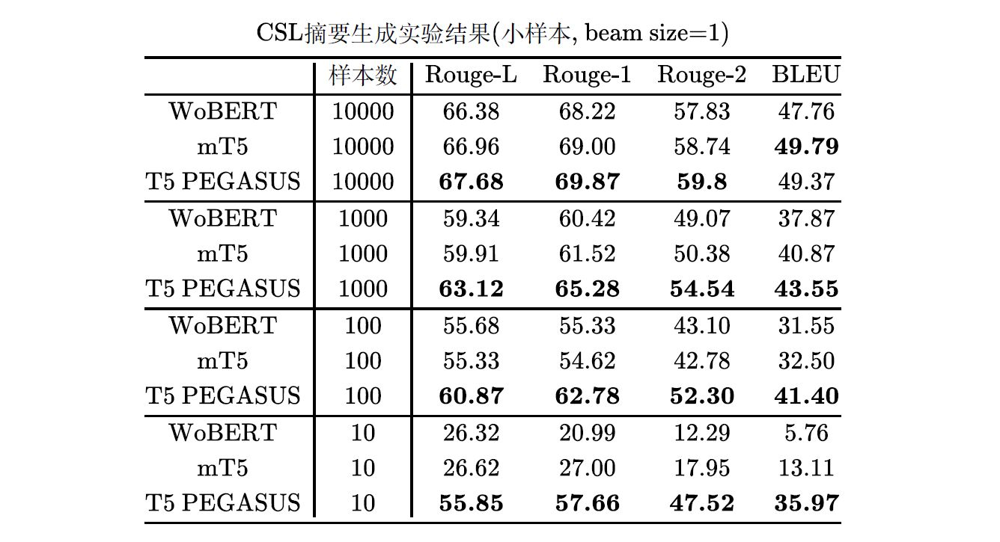

# NLP预训练模型的创新与实践

参考文章：

- [AI“大”时代下的NLP预训练模型创新与实践][https://zhuanlan.zhihu.com/p/366425818]


## **通用预训练模型**

通用预训练模型指的是在公开预料上进行的预训练模型，因为是在大量的非限定性领域语料上进行训练，因此对下游任务的语料领域没有严格的限制，可以被用在不同的领域和任务中。追一科技在通用预训练模型上进行了持续的投入，主要集中在三个方向上的研究：

- 中文还未覆盖的各类模型：主要目的在于研究模型在中文上的表现，并加以改进以进一步提升效果；
- 针对自身业务特点进行的通用预训练模型：主要目的在于采用不同的语料构建方式与模型结构、训练任务的设计，以便模型在业务领域中的下游任务能够有更好的表现；
- 针对特定下游任务形式进行优化的预训练模型：虽然通用型预训练模型可以在不同的下游任务上直接使用，但在预训练步骤中如果针对下游任务进行特定的设计，可以更好地提升下游任务的表现。


## **业务型预训练模型**

业务型预训练模型是针对追一科技的一些列产品形式专门设计的大型预训练模型。在实际的业务场景中，往往会面数据量少、数据质量低、行业专有概念多以及语义粒度细等一系列问题。而通用的大型预训练模型，由于其非限定语料以及语言模型任务的训练方式，虽然可以在开放领域上的大多下游任务中有着不错的平均表现，但在特定的专业领域和特定的任务上的表现却并不是最优的。

针对这一情况，我们希望在业务中使用的预训练模型能够在拥有大型通用预训练模型的整体能力外，还能针对领域专业词汇理解、数据效率、模型鲁棒性等方面有专门的优化与提升。我们将用在业务中的大型预训练模型命名为ZOne（**Z**ero-sh**o**t La**n**guage **E**ncoder）。它在业务场景中的表现不仅比开源的通用大型预训练模型有更好的效果，有更高的数据利用效率，同时还具有零样本的能力（即在没有相关业务标注数据的情况下进行语义理解）。

ZOne以我们的通用预训练模型为基础，在预训练阶段除了使用公开数据外，还加入了追一科技多年积累的行业数据，并融合了SimBERT近义句建模与WoBERT融入词粒度的特点。除此以外，ZOne还结合下游任务形式设计了多个损失函数进行多任务联合训练，我们将会在以后的文章中介绍ZOne模型的更多情况。我们在8个不同行业的业务数据上对比了ZOne模型与BERT、RoBERTa等的大型预训练模型的效果。


## **T5模型的再训练：更懂中文的T5 PEGASUS**

开源地址：

- [ZhuiyiTechnology](https://github.com/ZhuiyiTechnology)/**[t5-pegasus](https://github.com/ZhuiyiTechnology/t5-pegasus)**


T5 PEGASUS是T5和PEGASUS的结合，其中T5的思想是将一切NLP任务都转化为NLG任务来处理，跟GPT3有相似之处，它代表了自然语言处理的理想：万事都以自然语言表达，本次开源的模型基于T5的多国语言版本（mT5）进行改进；PEGASUS是Google提出的一种预训练方式，初衷是自动摘要，经过追一科技的改进，它可作为一种通用的生成式预处理任务，可用于更多场景。

**细节实现**

以mT5为基础通过中文语料构建PEGASUS任务对mT5进行继续预训练；改进中文分词器，使得它对中文更加友好，然后对训练预料进行细致筛选、去噪声等处理，经过一系列处理，原本的“泛、全”的多国语言mT5逐步转为“专、精”的中文T5 PEGASUS模型。

### **小样本效果出众**

此处意义：对于预训练模型的微调--fine-tune，需要知道所需的样本数量级别及可能达到的效果，做到心中有数，也为后续可能需要进行数据标注做个铺垫。

效果方面 T5 PEGASUS表现出色，比如在自动摘要任务的Rouge指标，它平均比原来的最优结果高出1%以上，在问题生成任务上同样达到了新高度，是当前中文NLG模型中的SOTA。

T5 PEGASUS可以大大降低NLG任务的标注数据量要求。使用少量带标签数据即可以训练处性能优异的模型，这样的小样本学习越来越值得关注。




## mT5--中文语言实践

参考：

- https://kexue.fm/archives/7867

mT5，即Multilingual T5，T5的多国语言版，出自最近的论文[《mT5: A massively multilingual pre-trained text-to-text transformer》](https://arxiv.org/abs/2010.11934)，Github为[multilingual-t5](https://github.com/google-research/multilingual-t5)，这也是将多语种NLP任务的榜单推到了一个新高度了。对中文NLP社区来说，最重要的是mT5里边包含了中文，有机会在中文任务中尝试下T5。

### T5.1.1

mT5跟T5一脉相承的，整体基本一样，但在模型结构方面，mT5使用的是T5.1.1方案，在此对它做个基本的介绍。

很多人都不知道的是，自从在去年10月发布后，T5在今年还经历了一次低调的小升级，具体细节可以查看[Github链接](https://github.com/google-research/text-to-text-transfer-transformer/blob/master/released_checkpoints.md)，官方把升级前的T5称为T5.1.0，而升级后的叫做T5.1.1。它主要的改动来自论文[《GLU Variants Improve Transformer》](https://arxiv.org/abs/2002.05202)，主要是借用了[《Language Modeling with Gated Convolutional Networks》](https://arxiv.org/abs/1612.08083)的GLU（Gated Linear Unit）来增强FFN部分的效果。具体来说，原来T5的FFN为（T5没有Bias）：
$$
\operatorname{FFN}(x)=\operatorname{relu}\left(x W_{1}\right) W_{2}
$$
现在改为了：
$$
\operatorname{FFN}_{\mathrm{GEGLU}}(x)=\left(\operatorname{gelu}\left(x W_{1}\right) \otimes x W_{2}\right) W_{3}
$$
也就是把relu激活的第一个变化层改为了gelu激活的门控线性单元，这样FFN层增加了50%参数，但是从论文效果看效果明显增加。此外，T5.1.1还对Embedding层做了改动，原来在T5.1.0中，Encoder和Decoder的Embedding层、Decoder最后预测概率分布的Softmax层都是共享同一个Embedding矩阵的，现在T5.1.1只让Encoder和Decoder的Embedding层共享，而Decoder最后预测概率分布的Softmax层则用了一个独立的Embedding矩阵，当然这会让参数量大大增加，但Google的结论说这样做效果会更好，其结论被总结在最近的论文[《Rethinking embedding coupling in pre-trained language models》](https://arxiv.org/abs/2010.12821)中。还有最后一点改动，T5.1.1在预训练阶段去掉了Dropout，而只有在下游微调阶段才使用Dropout。

经过这些调整后，Google重新训练并开放了全系列的T5.1.1模型，其下载地址可以在刚才的Github链接找到，注意T5.1.1只做了无监督预训练，但效果依然相当出色。由于T5.1.1提升明显，所以mT5也就继续使用了T5.1.1结构了

### 实践

此处简介在bert4keras上使用mT5模型来做中文文本生成任务的流程和技巧。bert4keras从0.9.1版本开始支持调用mT5模型，使用bert4keras加载mT5模型的基本代码：

```python
# 模型路径
config_path = '/root/kg/bert/mt5/mt5_small/t5_config.json'
checkpoint_path = '/root/kg/bert/mt5/mt5_small/model.ckpt-1000000'
spm_path = '/root/kg/bert/mt5/sentencepiece.model'

# 加载分词器
tokenizer = SpTokenizer(spm_path, token_start=None, token_end='</s>')

# 加载模型
t5 = build_transformer_model(
    config_path=config_path,
    checkpoint_path=checkpoint_path,
    model='t5.1.1',
    return_keras_model=False,
    name='T5',
)

encoder = t5.encoder
decoder = t5.decoder
model = t5.model
```

对于中文来说，tokenizer给出的结果是带有词的，即对于中文来说mT5是以词为单位的，只不过词颗粒度会比较少。

针对中文任务而言，由于mT5涵盖了101种语言、总词表25万，擦用了T5.1.1结构的Softmax不共享参数，导致了Embedding层占用了相当多的参数，比如mT5 small的参数量为3亿，其中Embedding相关就占了2.5亿，且里面有大量参数用不上。因此需要对中文任务的Embedding层进行精简。模型精简需要在两个Embedding矩阵中删除不需要的行，关键点在于：如何决定需要保留的token，以及如何得到一个精简后的sentencepiece模型。

方法：使用模型的25万token的tokenizer对自己收集的中文语料进行分词并统计分词结果，然后按照词频保留前面的部分(最后保留了3万多token)，这样可以确保把本任务需要的token保留下来，决定完词表后，需要修改新的sentencepiece模型。

经过处理后，要构建新模型只需多添加三行代码`keep_tokens`，所显示的显存消耗将大大降低，且中文的生成效果基本不变。

```python
# 模型路径
config_path = '/root/kg/bert/mt5/mt5_base/t5_config.json'
checkpoint_path = '/root/kg/bert/mt5/mt5_base/model.ckpt-1000000'
spm_path = '/root/kg/bert/mt5/sentencepiece_cn.model'
keep_tokens_path = '/root/kg/bert/mt5/sentencepiece_cn_keep_tokens.json'

# 加载分词器
tokenizer = SpTokenizer(spm_path, token_start=None, token_end='</s>')
keep_tokens = json.load(open(keep_tokens_path))

# 加载模型
t5 = build_transformer_model(
    config_path=config_path,
    checkpoint_path=checkpoint_path,
    keep_tokens=keep_tokens,
    model='t5.1.1',
    return_keras_model=False,
    name='T5',
)

encoder = t5.encoder
decoder = t5.decoder
model = t5.model
```


# NLP文本生成探索

参考文章：

- [NLG技术：文本生成技术多样化应用的探索之路][https://zhuanlan.zhihu.com/p/375142707]


### **预训练任务**

若想要把NLG与预训练任务结合起来，需要设计相应的预训练任务。NLG预训练为：选择一个特定的Seq2Seq所需的“输入-输出”对子对，用来训练该Seq2Seq模型，训练完成后再微调到下游的NLG任务中，以获得效果上的提升。

已有的预训练任务设计：

- GPT：可理解为Encoder的输入是空字符串，Decoder的输出是任意句子；
- UniLM：NLG部分，UniLM使用自然文本的上半段预测下半段来预训练；
- BART：完形填空原理，使用Seq2Seq原理来实现，Encoder输入带空的句子，Decoder输出原句子；
- T5：BART加强版，将连续多个[MASK]合并成一个，并且Decoder只需要预测要填空的部分；
- PEGASUS：PEGASUS主要是为摘要生成而设计的，它以最长公共子序列为指标，无监督地构建了一些伪摘要数据集来预训练。


### **首创BERT+UniLM**

在UniLM发布之后，它简单有效的设计确实惊艳了大家。然而，UniLM开源的预训练模型只有英文版的，中文没有可用的UniLM模型，而在当时来说，重新预训练一个中文模型成本又显得较大。

经过研究，我们发现了一个有趣的结果：直接将开源的BERT预训练模型配合UniLM的设计使用，也能明显地改善NLG的效果！也就是说，不用重新预训练一个UniLM模型，直接用UniLM加载BERT的预训练权重也能生效。我们将此结果同步到了中文社区，并放出来参考代码，得到了广大网友的尝试和肯定。

此外，这个结论多少颠覆了我们对于预训练模型的直观认知。一般来说，下游任务要跟预训练任务尽量一致，才能取得较好的效果。而我们“用UniLM加载BERT的权重”这一做法的有效性表明，预训练模型具有相当大的普适性，哪怕下游任务差异很大，加载预训练权重依然是值得的，这一结论对我们后续的预训练研究起到了很大的启示作用。


### **Seq2Seq式预训练**

T5 PEGASUS是国内首个中文生成式预训练模型T5 PEGASUS，在自动摘要、问题生成多个自然语言处理任务上，达到了新高度。值得注意的是，T5 PEGASUS凭借出色的小样本学习能力，还可以帮助企业和开发者大大减轻数据标注的负担。

顾名思义，T5 PEGASUS是T5和PEGASUS的结合。其中，T5的思想是将一切NLP任务都转化为NLG任务来处理，跟最近很火的GPT3有异曲同工之妙，它代表了自然语言处理的终极理想“万事都以自然语言表达”，也成为NLG研究的重要参考方向。本次开源的模型也正是在T5的多国语言版（mT5）的基础上进行改进的；而PEGASUS是Google提出来的一种预训练方式，虽然初衷是自动摘要，但经过追一团队的尝试，它可以作为一种通用的生成式预训练任务，开拓更多的场景。

具体来说，追一技术团队以mT5为出发点，通过中文语料构建PEGASUS任务来对mT5进行继续预训练。团队还改进了中文分词器，使得它对中文更加友好，然后对训练语料进行了细致地筛选、去噪等处理。一系列操作下来，原来的“泛”而“全”的多国语言mT5逐步转变为了“专”而“精”的中文T5 PEGASUS模型。


# NLP预训练模型优化探究

本文主旨：

- 探求基于中文的BERT模型的性能优化方法；

分享人：俊斌

参考文章：

1. [改改字典，让BERT安全提速不掉分][https://zhuanlan.zhihu.com/p/321703473]

## 1、苏剑林--改改字典，让BERT安全提速不减分

#### 开源地址

- https://github.com/ZhuiyiTechnology/WoBERT (目前采用的技术方法)
- https://github.com/dbiir/UER-py  (腾讯开源以词为单位的NLP预训练算法)

#### 思路分析

- 当前大部分的中文预训练模型都是以字为基本单位，即将中文语句拆分为一个个字；目前以词为单位的中文预训练模型很少，有腾讯的[UER][https://github.com/dbiir/UER-py]--以词为单位的BERT模型，但实测效果较差；本文开源基于词为单位的中文BERT模型，称为WoBERT（Word-based BERT），实验结果显示基于词的WoBERT在不少任务上有独特的优势：速度明显提升同时效果基本不降甚至有所提升。

#### 字还是词？

香侬科技在ACL2019上发表的**[《Is Word Segmentation Necessary for Deep Learning of Chinese Representations?》](https://link.zhihu.com/?target=https%3A//arxiv.org/pdf/1905.05526)**，里边得到了字几乎总是优于词的结论，但这个实验结果并没有代表性。因为该实验的设置：模型的Embedding层都是从随机初始化状态开始训练，这样一来对于同样的任务，以词为单位的模型的Embedding层参数更多，自然更容易过拟合导致效果变差。问题是，我们在使用基于词的模型时，通常并不是随机初始化，往往都是使用预训练好的词向量（下游任务根据情况进行微调），这才是分词的NLP模型的经典场景，所以该论文的结果没有说服力。

“过拟合”现象具有两面性，需要防止过拟合，但过拟合也说明模型拥有较强的拟合能力，只要想办法抑制过拟合就能够在同样复杂度下得到更强大的模型，或者在同样效果下得到低复杂度的模型。而缓解过拟合的重要手段之一就是更充分的预训练。

#### 词的好处

一般认为，以字为单位的好处有：

1. 参数更少，不容易过拟合；
2. 不依赖分词算法，避免了边界切分错误；
3. 没有严重的稀疏性，基本不会出现未登录词；

以词为单位的理由：

1. 序列变短，处理速度加快；
2. 在文本生成任务上，能缓解Exposure Bias问题；
3. 词义的不确定性降低，降低建模复杂度；

对于第二点，词能缓解Exposure Bias，因为理论上来说：序列越短、Exposure Bias问题就越不明显，词的模型单步预测出一个 $n$ 字词，相当于字的模型预测了 $n$ 步，这 $n$ 步都递归依赖，所以字的模型Exposure Bias问题更严重。至于第三点，虽然有多义词的存在，但多义词的含义是比较确定的，至少比字义更加明确，这样一来可能只需要一个Embedding层就能把词义建模好，而不是像字模型那样需要多层模型才能把字组合成词。

以字为单位的好处并非就是以词为单位的缺点，只需多一些技巧，以词为单位也能一定程度上避免这几个问题：

1. 以词为单位的参数多，可以通过预训练来缓解过拟合；
2. 依赖分词算法是个问题，但如果只保留最常见的一部分词，那么不管哪个分词工具的结果都差不多；
3. 对于边界切分错误的问题，难以避免，但需要准确的边界，只是序列标注类任务而已，文本分类、文本生成都不需要准确的边界，故不能就此否定词模型；
4. 若把大部分字加入到词表中，就不会出现未登录词；


#### Tokenizer

往BERT里直接加入中文词，需要先让Tokenizer能分出词来。

只需要把词加入到字典vocab.txt里面就可以了吗？

**No!**

BERT自带的Tokenizer会强行把中文字符用空格分开，因此就算把词加入到字典中，也不会切分出中文词。此外，BERT做英文的word piece的分词时使用的是最大匹配法，对中文分词来说精度不够。

为了中文分词，需要修改BERT的Tokenizer，加入一个  **pre_tokenize** 操作就可以分出中文词，具体操作为：

1. 把中文词加入到 vocab.txt；
2. 输入一个句子$s$，用 pre_tokenize先分一次词，得到 $[w_1 , w_2 ,..., w_l]$；
3. 遍历各个 $w_i$，如果$w_i$在词表中则保留，否则将$w_i$使用BERT自带的tokenize函数再分一次；
4. 将每个$w_i$的tokenize结果有序的结合起来，作为最后的tokenize结果；


在bert4keras>=0.8.8版本中，**实现上述改动只需要在构建Tokenizer的时候传入一行参数：**

```python
tokenizer = Tokenizer(
    dict_path,
    do_lower_case=True,
    pre_tokenize=lambda s: jieba.cut(s, HMM=False)
)
```

其中`pre_tokenize`为外部传入的分词函数，如果不传入则默认为`None`。本文的WoBERT使用jieba分词，删除了BERT自带词表的冗余部分（如带##的中文词），加入了 $20,000$ 个额外的中文词（jieba分词自带的词表词频最高的两万个），最终WoBERT的vocab.txt规模是 $33586$。

#### 模型细节

目前开源的WoBERT是Base版本，在哈工大开源的**[RoBERTa-wwm-ext](https://link.zhihu.com/?target=https%3A//github.com/ymcui/Chinese-BERT-wwm)**基础上进行继续预训练，预训练任务为MLM。初始化阶段，将每个词用BERT自带的Tokenizer切分为字，然后用字embedding的平均作为词embedding的初始化。

到这里，WoBERT的技术要点基本上都说清楚了，剩下的就是开始训练了。我们用单张24G的RTX训练了100万步（大概训练了10天），序列长度为512，学习率为5e-6，batch_size为16，累积梯度16步，相当于batch_size=256训练了6万步左右。训练语料大概是30多G的通用型语料。训练代码已经在文章开头的链接中开源了。
