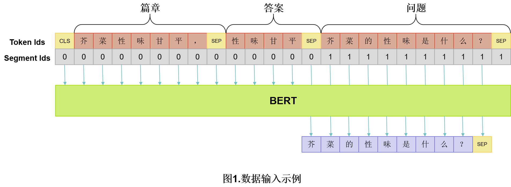
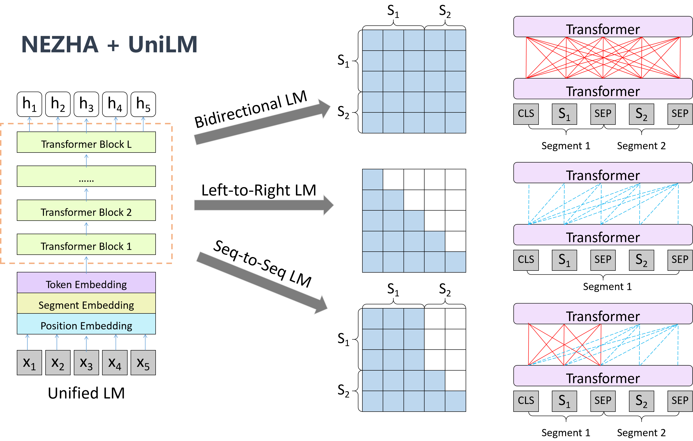

# NLP--问题生成代码解析


#### 目前使用的代码及预训练模型源：

- [代码来源][https://github.com/kangyishuai/CHINESE-MEDICINE-QUESTION-GENERATION]

- 预训练模型

  - [来源1][https://github.com/chenxichen95/Tianchi2020ChineseMedicineQuestionGeneration]
  - [来源2][https://github.com/ZhuiyiTechnology/WoBERT]
  - [来源3][https://github.com/huawei-noah/Pretrained-Language-Model/tree/master/NEZHA-TensorFlow]

  

#### 背景说明：

源代码以解决中药领域的问题生成为主展开，该任务需要模型根据篇章及对应的答案自动生成对应的问题。即：篇章+答案 --> 问题。

本文采用Seq2Seq模型来端到端实现问题生成，模型的输入为篇章和答案，输出为问题。



**思路分析：**

- 数据预处理：数据清洗，剔除空白字符、带括号的英文；
- 文本截断：篇章中答案所在位置的附近与问题的相关性最强，答案的前面部分信息最多，问题文本最长131个字符。具体操作是篇章取答案所在位置的前64个字符和后128个字符；答案取前64个字符；问题取前131个字符；
- 数据输入：训练时按照“[CLS]篇章[SEP]答案[SEP]问题[SEP]”格式输入。推断时按照“[CLS]篇章[SEP]答案[SEP]”格式输入；
- 模型架构：使用“NEZHA + UniLM”的方式来构建一个Seq2Seq模型，端到端地实现“篇章 + 答案 → 问题”；



- 缓解Exposure Bias问题的策略
  1. 随机替换Decoder的输入词来构建“有代表性”的负样本；
  2. 使用对抗训练来生成扰动样本
- 解码：使用Beam search来对问题进行解码；
- 解决显存不足的方法：需要更长的时间进行训练；
- 其他tricks：
  - 在单模型上使用5折交叉验证；
  - 对词表进行精简（最后的预测生成时，事实上有一半的token不会被使用，因此可以通过精简来节省算力）
  - EarlyStopping
  - 伪标签（需要后续进行研究 


作者的经验总结：

1. 使用文本截断策略使得文本能够在满足预训练模型输入的要求下，较少的损失上下文信息，提分效果显著；
2. nezha-large-wwm预训练模型是我们队试过效果是最好的模型，单个的nezha-large-wwm加上之前的技巧就能达到0.64+；
3. 使用随机替换和对抗训练能够缓解Exposure Bias，使用这两个trick后效果提升也比较明显，大约有百分之二提升；
4. 不使用交叉验证，不划分验证集的情况下，使用全部训练数据进行训练，大约第12个epoch效果最好。使用交叉验证后效果会优于全量训练的结果，缺点是训练推断时间太长；
5. 梯度累积使得能够用较大的batch size训练large模型，分数上也有细微的提升。


## 代码解析


数据清洗代码--utils.py

```python
import json
import re
from collections import defaultdict
import pandas as pd

def json2df(filename):
    """json转pandas.DataFrame。"""
    json_data = json.load(open(filename))
    D = defaultdict(list)
    for d in json_data:
        for qa in d['annotations']:
            D['passage'].append(d['text'])
            D['question'].append(qa['Q'])
            D['answer'].append(qa['A'])

    return pd.DataFrame(D)


def preprocess(df):
    """数据预处理。"""
    # 剔除空白字符
    df = df.applymap(lambda x: re.sub(r'\s', '', x))
    df = df.applymap(lambda x: re.sub(r'\\n', '', x))

    # 剔除带括号的英文
    func = lambda m: '' if len(m.group(0)) > 5 else m.group(0)
    df = df.applymap(lambda x: re.sub(r'\([A-Za-z]+\)', func, x))
    df = df.applymap(lambda x: re.sub(r'（[A-Za-z]+）', func, x))

    # 筛选出答案与篇章不匹配的数据
    tmp = list()
    for idx, row in df.iterrows():
        if row['answer'] not in row['passage']:
            tmp.append(idx)

    # 处理部分不匹配数据
    no_match = df.loc[tmp]
    df.drop(index=tmp, inplace=True)
    no_match['answer'] = no_match['answer'].map(lambda x: x.replace('.', ''))
    df = pd.concat([df, no_match])
    df.reset_index(drop=True, inplace=True)

    return df
```

中药数据json格式的说明：

```json
[
    {
        "id": xxx,
        "text": "xxx",
        "annotations": [
            {
                "Q": "XXX",
                "A": "XXX"
            },
            {
                "Q": "XXX",
                "A": "XXX"
            },
        ]
    }
]
```


对模型进行fine-tune微调时，使用的中文语料数据集为：CMRC2018，该数据集的json格式为：

```json
[
    {
        "context_id": xxx,
        "context_text": xxx,
        "qas":[
            {
                "query_text": xxx,
            	"query_id": xxx,
            	"answers": xxx
            },
            {
               xxx 
            }
        ]
        "title": xxx
    }
]
```


因此需要对数据预处理代码做如下更改：

```python
def json2df(filename):
    json_data = json.load(open(filename, "r", encoding='utf-8'))
    D = defaultdict(list)
    for row in json_data:
        for row_anno in row['qas']:
            D['passage'].append(row['context_text'])
            D['question'].append(row_anno['query_text'])
            D['answer'].append(row_anno['answers'])
            
    return pd.DataFrame

def preprocess(df):
    """数据预处理，剔除无效字符"""
    df = df.applymap(lambda x: re.sub(r'\s', '', str(x)))
    df = df.applymap(lambda x: re.sub(r'\\n', '', str(x)))
    func = lambda m: '' if len(m.group(0)) > 5 else m.group(0)
    df = df.applymap(lambda x: re.sub(r'\([A-Za-z]+\)', func, str(x)))
    df = df.applymap(lambda x: re.sub(r'([A-Za-z]+)', func, str(x)))
    
    # 筛选出答案与篇章不匹配的数据
    tmp = list()
    for idx, row in df.iterrows():
        if row['answer'] not in row['passage']:
            tmp.append(idx)
            
    # 处理部分不匹配数据
    no_match = df.loc[tmp]
    df.drop(index=tmp, inplace=True)
    no_match['answer'] = no_match['answer'].map(lambda x: x.replace('.', ''))
    df = pd.concat([df, no_match])
    df.reset_index(drop=True, inplace=True)
    
    return df
```

主要注意点：

1. 不同json格式的读取需要注意；
2. preprocess过程中的读取str字符串处需要转化；
3. 对答案与篇章不匹配数据的筛选可提高准确率；

继续提升模型性能的可选方向：

1. 增加训练数据集的数量；
2. 对现有数据集进行探索，调整源代码的参数设置以适应目前fine-tune的数据需要；
3. 大规模的参数调优尝试，主要尝试更改lr、len_text、operator


train.py

```python
import keras.backend.tensorflow_backend as KTF
import numpy as np
import tensorflow as tf
from bert4keras.backend import keras, K, search_layer
from bert4keras.models import build_transformer_model
from bert4keras.optimizers import Adam
from bert4keras.snippets import DataGenerator, AutoRegressiveDecoder
from bert4keras.snippets import sequence_padding
from bert4keras.tokenizers import Tokenizer, load_vocab
from keras.callbacks import EarlyStopping, ModelCheckpoint
from keras.layers import Input
from keras.models import Model
from rouge import Rouge  # pip install rouge
from sklearn.model_selection import KFold
from tqdm import tqdm

from utils import json2df, preprocess

# 基本参数
n = 5               # 交叉验证
max_p_len = 194     # 篇章最大长度
max_q_len = 131     # 问题最大长度
max_a_len = 65      # 答案最大长度
head = 64           # 篇章截取中，取答案id前head个字符
batch_size = 4      # 批大小
epochs = 20         # 迭代次数
SEED = 2020         # 随机种子

# nezha配置
config_path = '../user_data/model_data/NEZHA-Large-WWM/bert_config.json'
checkpoint_path = '../user_data/model_data/NEZHA-Large-WWM/model.ckpt-346400'
dict_path = '../user_data/model_data/NEZHA-Large-WWM/vocab.txt'

# 加载并精简词表，建立分词器
token_dict, keep_tokens = load_vocab(
    dict_path=dict_path,
    simplified=True,
    startswith=['[PAD]', '[UNK]', '[CLS]', '[SEP]'],
)
tokenizer = Tokenizer(token_dict, do_lower_case=True)


def load_data(filename):
    """加载数据。"""
    df = json2df(filename)  # json转DataFrame
    df = preprocess(df)     # 数据预处理

    # 文本截断
    D = list()
    for _, row in df.iterrows():
        passage = row['passage']
        question = row['question']
        answer = row['answer']
        if len(passage) < max_p_len - 2 and len(answer) < max_a_len - 1:
            D.append((passage, question, answer))
        else:
            a = answer[:max_a_len-1] if len(answer) > max_a_len - 1 else answer
            try:
                idx = passage.index(a)
                if len(passage[idx:]) < (max_p_len - 2 - head):
                    p = passage[-(max_p_len - 2):]
                else:
                    p = passage[max(0, idx - head):]
                    p = p[:max_p_len - 2]
            except ValueError:
                p = passage[:max_p_len - 2]
            D.append((p, question, a))

    return D


class data_generator(DataGenerator):
    """数据生成器。"""
    def __init__(self, data, batch_size=32, buffer_size=None, random=False):
        super().__init__(data, batch_size, buffer_size)
        self.random = random

    def __iter__(self, random=False):
        """单条样本格式：[CLS]篇章[SEP]答案[SEP]问题[SEP]。"""
        batch_token_ids, batch_segment_ids, batch_o_token_ids = [], [], []
        for is_end, (p, q, a) in self.sample(random):
            p_token_ids, _ = tokenizer.encode(p, maxlen=max_p_len)
            a_token_ids, _ = tokenizer.encode(a, maxlen=max_a_len)
            q_token_ids, _ = tokenizer.encode(q, maxlen=max_q_len)
            token_ids = p_token_ids + a_token_ids[1:] + q_token_ids[1:]
            segment_ids = [0] * (len(p_token_ids) + len(a_token_ids[1:]))
            segment_ids += [1] * (len(token_ids) - len(p_token_ids) - len(a_token_ids[1:]))
            o_token_ids = token_ids
            if np.random.random() > 0.5:
                token_ids = [
                    t if s == 0 or (s == 1 and np.random.random() > 0.3)
                    else np.random.choice(token_ids)
                    for t, s in zip(token_ids, segment_ids)
                ]
            batch_token_ids.append(token_ids)
            batch_segment_ids.append(segment_ids)
            batch_o_token_ids.append(o_token_ids)
            if len(batch_token_ids) == self.batch_size or is_end:
                batch_token_ids = sequence_padding(batch_token_ids)
                batch_segment_ids = sequence_padding(batch_segment_ids)
                batch_o_token_ids = sequence_padding(batch_o_token_ids)
                yield [batch_token_ids, batch_segment_ids, batch_o_token_ids], None
                batch_token_ids, batch_segment_ids, batch_o_token_ids = [], [], []

    def forfit(self):
        while True:
            for d in self.__iter__(self.random):
                yield d


def build_model():
    """构建模型。"""
    model = build_transformer_model(
        config_path,
        checkpoint_path,
        model='nezha',
        application='unilm',
        keep_tokens=keep_tokens,  # 只保留keep_tokens中的字，精简原字表
    )

    o_in = Input(shape=(None, ))
    train_model = Model(model.inputs + [o_in], model.outputs + [o_in])

    # 交叉熵作为loss，并mask掉输入部分的预测
    y_true = train_model.input[2][:, 1:]  # 目标tokens
    y_mask = train_model.input[1][:, 1:]
    y_pred = train_model.output[0][:, :-1]  # 预测tokens，预测与目标错开一位
    cross_entropy = K.sparse_categorical_crossentropy(y_true, y_pred)
    cross_entropy = K.sum(cross_entropy * y_mask) / K.sum(y_mask)

    train_model.add_loss(cross_entropy)
    train_model.compile(optimizer=Adam(1e-5))

    return model, train_model


def adversarial_training(model, embedding_name, epsilon=1.):
    """给模型添加对抗训练
    其中model是需要添加对抗训练的keras模型，embedding_name
    则是model里边Embedding层的名字。要在模型compile之后使用。
    """
    if model.train_function is None:  # 如果还没有训练函数
        model._make_train_function()  # 手动make
    old_train_function = model.train_function  # 备份旧的训练函数

    # 查找Embedding层
    for output in model.outputs:
        embedding_layer = search_layer(output, embedding_name)
        if embedding_layer is not None:
            break
    if embedding_layer is None:
        raise Exception('Embedding layer not found')

    # 求Embedding梯度
    embeddings = embedding_layer.embeddings  # Embedding矩阵
    gradients = K.gradients(model.total_loss, [embeddings])  # Embedding梯度
    gradients = K.zeros_like(embeddings) + gradients[0]  # 转为dense tensor

    # 封装为函数
    inputs = (
            model._feed_inputs + model._feed_targets + model._feed_sample_weights
    )  # 所有输入层
    embedding_gradients = K.function(
        inputs=inputs,
        outputs=[gradients],
        name='embedding_gradients',
    )  # 封装为函数

    def train_function(inputs):  # 重新定义训练函数
        grads = embedding_gradients(inputs)[0]  # Embedding梯度
        delta = epsilon * grads / (np.sqrt((grads ** 2).sum()) + 1e-8)  # 计算扰动
        K.set_value(embeddings, K.eval(embeddings) + delta)  # 注入扰动
        outputs = old_train_function(inputs)  # 梯度下降
        K.set_value(embeddings, K.eval(embeddings) - delta)  # 删除扰动
        return outputs

    model.train_function = train_function  # 覆盖原训练函数


class QuestionGeneration(AutoRegressiveDecoder):
    """通过beam search来生成问题。"""
    def __init__(self, model, *args, **kwargs):
        super().__init__(*args, **kwargs)
        self.model = model

    @AutoRegressiveDecoder.wraps(default_rtype='probas')
    def predict(self, inputs, output_ids, states):
        token_ids, segment_ids = inputs
        token_ids = np.concatenate([token_ids, output_ids], 1)
        segment_ids = np.concatenate([segment_ids, np.ones_like(output_ids)], 1)
        return self.model.predict([token_ids, segment_ids])[:, -1]

    def generate(self, passage, answer, topk=5):
        p_token_ids, _ = tokenizer.encode(passage, maxlen=max_p_len)
        a_token_ids, _ = tokenizer.encode(answer, maxlen=max_a_len)
        token_ids = p_token_ids + a_token_ids[1:]
        segment_ids = [0] * (len(p_token_ids) + len(a_token_ids[1:]))
        q_ids = self.beam_search([token_ids, segment_ids], topk)  # 基于beam search
        return tokenizer.decode(q_ids)


class Evaluator(keras.callbacks.Callback):
    """计算验证集rouge_l。"""
    def __init__(self, valid_data, qg):
        super().__init__()
        self.rouge = Rouge()
        self.best_rouge_l = 0.
        self.valid_data = valid_data
        self.qg = qg

    def on_epoch_end(self, epoch, logs=None):
        rouge_l = self.evaluate(self.valid_data)  # 评测模型
        if rouge_l > self.best_rouge_l:
            self.best_rouge_l = rouge_l
        logs['val_rouge_l'] = rouge_l
        print(
            f'val_rouge_l: {rouge_l:.5f}, '
            f'best_val_rouge_l: {self.best_rouge_l:.5f}',
            end=''
        )

    def evaluate(self, data, topk=1):
        total, rouge_l = 0, 0
        for p, q, a in tqdm(data):
            total += 1
            q = ' '.join(q)
            pred_q = ' '.join(self.qg.generate(p, a, topk))
            if pred_q.strip():
                scores = self.rouge.get_scores(hyps=pred_q, refs=q)
                rouge_l += scores[0]['rouge-l']['f']
        rouge_l /= total

        return rouge_l


def do_train():
    data = load_data('../data/round1_train_0907.json')  # 加载数据

    # 交叉验证
    kf = KFold(n_splits=n, shuffle=True, random_state=SEED)
    for fold, (trn_idx, val_idx) in enumerate(kf.split(data), 1):
        print(f'Fold {fold}')

        # 配置Tensorflow Session
        config = tf.ConfigProto()
        config.gpu_options.allow_growth = True  # 不全部占满显存, 按需分配
        sess = tf.Session(config=config)
        KTF.set_session(sess)

        # 划分训练集和验证集
        train_data = [data[i] for i in trn_idx]
        valid_data = [data[i] for i in val_idx]

        train_generator = data_generator(train_data, batch_size, random=True)

        model, train_model = build_model()  # 构建模型

        adversarial_training(train_model, 'Embedding-Token', 0.5)  # 对抗训练

        # 问题生成器
        qg = QuestionGeneration(
            model, start_id=None, end_id=tokenizer._token_dict['？'],
            maxlen=max_q_len
        )

        # 设置回调函数
        callbacks = [
            Evaluator(valid_data, qg),
            EarlyStopping(
                monitor='val_rouge_l',
                patience=1,
                verbose=1,
                mode='max'),
            ModelCheckpoint(
                f'../user_data/model_data/fold-{fold}.h5',
                monitor='val_rouge_l',
                save_weights_only=True,
                save_best_only=True,
                verbose=1,
                mode='max'),
        ]

        # 模型训练
        train_model.fit_generator(
            train_generator.forfit(),
            steps_per_epoch=len(train_generator),
            epochs=epochs,
            callbacks=callbacks,
        )

        KTF.clear_session()
        sess.close()


if __name__ == '__main__':
    do_train()
```

其中进行fine-tune时需对模型做下述更改：

```python
def do_train():
    """此处省略部分代码"""
    # 加载预训练模型
    models = []
    model, train_model = build_model()   #构建模型
    train_model.load_weights(f'../xxx/base-model.h5')
    models.append(model)
```


**目前的问题生成解决思路梳理：**

目前尝试的是基于迁移学习+预训练模型的方法，该方法有效性在很多nlp项目中得到了验证。其中预训练模型采用的是基于[来源2]的模型参数，并在此基础上使用中药数据进行训练，然后在中药数据训练的模型参数的基础上再使用CMRC2018数据集进行训练，然后再测试由策划选定的问题集进行测试，从而评估模型的问题生成效果。

**A/B测试：**

直接使用原始的预训练模型进行CMRC2018数据集进行测试， 然后与基于中药数据集+CMRC2018数据集进行训练的模型对比。通过对比评估基于中药数据集预训练的模型是否能够带来一定的模型性能提升。

实验设计详情：

实验中均使用early-stop测试，patient参数设置为2.

| A/B测试 |     预训练模型(base-model)     | CN-Med Dataset | CMRC2018 Dataset | Best-Model性能表现(val_rouge) |
| :-----: | :----------------------------: | :------------: | :--------------: | :---------------------------: |
|    A    | chinese_wobert_L-12_H-768_A-12 |       +        |        +         |            0.60665            |
|    B    | chinese_wobert_L-12_H-768_A-12 |       \        |        +         |            0.58840            |

结论：

在对比基于bert的预训练模型基础上，通过在fine-tune之前是否使用CNMed数据集进行再次训练，来验证基于CNMed的预训练模型对目前本项目的问题生成质量是否有提升，结果显示，使用基于CNMed数据集训练的模型进行CMRC2018数据集的fine-tune取得了更加优秀的效果。

启发：

更多的高质量数据集加入训练，模型将取得更加优秀和稳定的性能提升。
